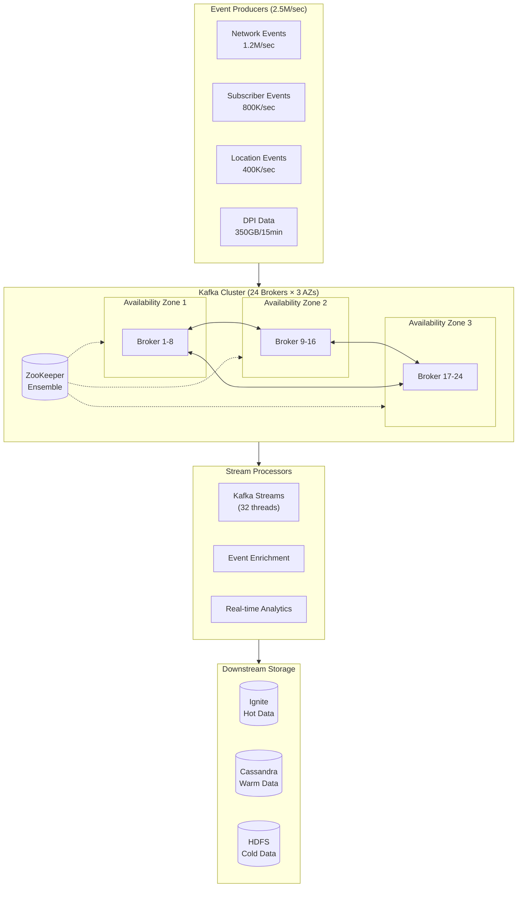

In Parts 1-3, we explored our system architecture, data partitioning, and memory management. Today, we'll dive deep into how we optimized Apache Kafka to handle 2.5 million events per second while ensuring reliable message delivery and processing.

## Infrastructure Scale

### Cluster Configuration

- 24 broker nodes across 3 availability zones
- Each broker: 144 cores, 256GB RAM
- RAID10 NVMe storage
- 25Gbps network interfaces
- Dedicated ZooKeeper ensemble

### Topic Design

```properties
# Network Events (1.2M/sec)
network.events.${region}.${type} = {
    partitions = 600,
    replication.factor = 3,
    min.insync.replicas = 2,
    retention.ms = 604800000  # 7 days
}

# Subscriber Events (800K/sec)
subscriber.events.${region}.${type} = {
    partitions = 400,
    replication.factor = 3,
    min.insync.replicas = 2,
    retention.ms = 604800000
}

# Location Events (400K/sec)
location.updates.${region} = {
    partitions = 200,
    replication.factor = 3,
    min.insync.replicas = 2,
    retention.ms = 259200000  # 3 days
}

# DPI Data (350GB/15min)
dpi.data.${region}.${window} = {
    partitions = 100,
    replication.factor = 3,
    min.insync.replicas = 2,
    retention.ms = 86400000   # 1 day
}
```

## Producer Optimization

### Producer Configuration

```java
public class OptimizedProducerConfig {
    public Properties getConfig() {
        Properties props = new Properties();

        // Basic Configuration
        props.put(ProducerConfig.BOOTSTRAP_SERVERS_CONFIG,
                 "kafka1:9092,kafka2:9092,kafka3:9092");
        props.put(ProducerConfig.KEY_SERIALIZER_CLASS_CONFIG,
                 "org.apache.kafka.common.serialization.StringSerializer");
        props.put(ProducerConfig.VALUE_SERIALIZER_CLASS_CONFIG,
                 "org.apache.kafka.common.serialization.ByteArraySerializer");

        // Performance Optimization
        props.put(ProducerConfig.BATCH_SIZE_CONFIG, 1048576);       // 1MB batch size
        props.put(ProducerConfig.LINGER_MS_CONFIG, 5);             // 5ms linger
        props.put(ProducerConfig.COMPRESSION_TYPE_CONFIG, "lz4");   // LZ4 compression
        props.put(ProducerConfig.BUFFER_MEMORY_CONFIG, 67108864);   // 64MB buffer

        // Reliability Settings
        props.put(ProducerConfig.ACKS_CONFIG, "1");                // Leader acknowledgment
        props.put(ProducerConfig.RETRIES_CONFIG, 3);               // Retry count
        props.put(ProducerConfig.MAX_IN_FLIGHT_REQUESTS_PER_CONNECTION, 5);
        props.put(ProducerConfig.ENABLE_IDEMPOTENCE_CONFIG, true); // Exactly-once

        return props;
    }
}
```

### Batch Processing Implementation

```java
public class BatchProducer {
    private final KafkaProducer<String, byte[]> producer;
    private final String topic;
    private final int batchSize = 10000;
    private final List<ProducerRecord<String, byte[]>> batch;

    public void sendBatch(List<Event> events) {
        List<CompletableFuture<RecordMetadata>> futures = new ArrayList<>();

        for (Event event : events) {
            ProducerRecord<String, byte[]> record = new ProducerRecord<>(
                topic,
                event.getPartitionKey(),
                event.serialize()
            );

            CompletableFuture<RecordMetadata> future =
                CompletableFuture.supplyAsync(() -> {
                    try {
                        return producer.send(record).get();
                    } catch (Exception e) {
                        handleError(record, e);
                        return null;
                    }
                });

            futures.add(future);

            if (futures.size() >= batchSize) {
                CompletableFuture.allOf(
                    futures.toArray(new CompletableFuture[0])
                ).join();
                futures.clear();
            }
        }
    }
}
```

## Consumer Optimization

### Consumer Configuration

```java
public class OptimizedConsumerConfig {
    public Properties getConfig() {
        Properties props = new Properties();

        // Basic Configuration
        props.put(ConsumerConfig.BOOTSTRAP_SERVERS_CONFIG,
                 "kafka1:9092,kafka2:9092,kafka3:9092");
        props.put(ConsumerConfig.GROUP_ID_CONFIG, "event-processor");
        props.put(ConsumerConfig.AUTO_OFFSET_RESET_CONFIG, "earliest");

        // Performance Settings
        props.put(ConsumerConfig.FETCH_MIN_BYTES_CONFIG, 1048576);     // 1MB min fetch
        props.put(ConsumerConfig.FETCH_MAX_BYTES_CONFIG, 52428800);    // 50MB max fetch
        props.put(ConsumerConfig.MAX_POLL_RECORDS_CONFIG, 10000);      // Max records per poll
        props.put(ConsumerConfig.MAX_PARTITION_FETCH_BYTES_CONFIG, 10485760); // 10MB per partition

        // Reliability Settings
        props.put(ConsumerConfig.ENABLE_AUTO_COMMIT_CONFIG, false);    // Manual commit
        props.put(ConsumerConfig.MAX_POLL_INTERVAL_MS_CONFIG, 300000); // 5 minutes max processing
        props.put(ConsumerConfig.SESSION_TIMEOUT_MS_CONFIG, 60000);    // 1 minute timeout

        return props;
    }
}
```

### Parallel Processing Implementation

```java
public class ParallelConsumer implements Runnable {
    private final KafkaConsumer<String, byte[]> consumer;
    private final ExecutorService executor;
    private final int workerThreads = 32;
    private volatile boolean running = true;

    public void run() {
        try {
            while (running) {
                ConsumerRecords<String, byte[]> records =
                    consumer.poll(Duration.ofMillis(100));

                if (!records.isEmpty()) {
                    processRecordsInParallel(records);
                }
            }
        } finally {
            consumer.close();
            executor.shutdown();
        }
    }

    private void processRecordsInParallel(
            ConsumerRecords<String, byte[]> records) {
        // Group records by partition
        Map<TopicPartition, List<ConsumerRecord<String, byte[]>>>
            partitionedRecords = StreamSupport
                .stream(records.spliterator(), false)
                .collect(Collectors.groupingBy(record ->
                    new TopicPartition(
                        record.topic(),
                        record.partition()
                    )));

        // Process each partition's records in parallel
        List<CompletableFuture<Void>> futures =
            partitionedRecords.entrySet().stream()
                .map(entry -> CompletableFuture.runAsync(() ->
                    processPartitionRecords(entry.getValue()),
                    executor))
                .collect(Collectors.toList());

        // Wait for all processing to complete
        CompletableFuture.allOf(
            futures.toArray(new CompletableFuture[0])
        ).join();

        // Commit offsets
        consumer.commitSync();
    }
}
```

## Stream Processing Optimization

### Kafka Streams Configuration

```java
public class StreamsConfig {
    public Properties getConfig() {
        Properties props = new Properties();

        // Basic Settings
        props.put(StreamsConfig.BOOTSTRAP_SERVERS_CONFIG,
                 "kafka1:9092,kafka2:9092,kafka3:9092");
        props.put(StreamsConfig.APPLICATION_ID_CONFIG, "event-processor");

        // Performance Tuning
        props.put(StreamsConfig.NUM_STREAM_THREADS_CONFIG, 32);
        props.put(StreamsConfig.CACHE_MAX_BYTES_BUFFERING_CONFIG,
                 134217728); // 128MB cache
        props.put(StreamsConfig.COMMIT_INTERVAL_MS_CONFIG, 100);
        props.put(StreamsConfig.PROCESSING_GUARANTEE_CONFIG,
                 "exactly_once_v2");

        // State Store Settings
        props.put(StreamsConfig.STATE_DIR_CONFIG, "/data/kafka-streams");
        props.put(StreamsConfig.REPLICATION_FACTOR_CONFIG, 3);

        return props;
    }
}
```

### Stream Processing Implementation

```java
public class EventStreamProcessor {
    public Topology createTopology() {
        StreamsBuilder builder = new StreamsBuilder();

        // Create event streams
        KStream<String, Event> events = builder
            .stream("events",
                Consumed.with(Serdes.String(), eventSerde));

        // Process network events
        KStream<String, Event> networkEvents = events
            .filter((key, event) ->
                event.getType() == EventType.NETWORK)
            .mapValues(this::enrichNetworkEvent)
            .repartition(32); // Increase parallelism

        // Process subscriber events
        KStream<String, Event> subscriberEvents = events
            .filter((key, event) ->
                event.getType() == EventType.SUBSCRIBER)
            .mapValues(this::enrichSubscriberEvent)
            .repartition(32);

        // Join streams and process
        KStream<String, EnrichedEvent> enrichedEvents =
            networkEvents.join(
                subscriberEvents,
                this::joinEvents,
                JoinWindows.of(Duration.ofSeconds(10))
            );

        // Store results
        enrichedEvents.to("enriched-events");

        return builder.build();
    }
}
```

## Monitoring and Alerting

### Key Metrics

1. Producer Metrics

   - Batch size avg/max
   - Record send rate
   - Record error rate
   - Buffer pool usage

2. Consumer Metrics

   - Record lag
   - Poll rate
   - Processing time
   - Rebalance events

3. Broker Metrics
   - Under-replicated partitions
   - Request handler idle %
   - Network processor avg idle %
   - Log flush latency

### Monitoring Implementation

```java
public class KafkaMonitor {
    private final MetricRegistry metrics;
    private final AlertManager alertManager;

    public void collectMetrics() {
        // Producer metrics
        metrics.gauge("kafka.producer.batch.size", () ->
            getProducerBatchSize());
        metrics.gauge("kafka.producer.send.rate", () ->
            getProducerSendRate());

        // Consumer metrics
        metrics.gauge("kafka.consumer.lag", () ->
            getConsumerLag());
        metrics.gauge("kafka.consumer.processing.time", () ->
            getConsumerProcessingTime());

        // Broker metrics
        metrics.gauge("kafka.broker.under.replicated.partitions", () ->
            getUnderReplicatedPartitions());
        metrics.gauge("kafka.broker.request.handler.avg.idle", () ->
            getRequestHandlerAvgIdle());

        // Check thresholds and alert
        checkThresholdsAndAlert();
    }
}
```

## Lessons Learned

### 1. Cluster Design and Sizing

#### Infrastructure Planning

- **Start with 2x Expected Capacity**
  - Account for peak loads
  - Plan for data growth
  - Consider replication factor
  - Reserve capacity for rebalancing

#### Implementation Example

```java
public class ClusterCapacityCalculator {
    public ClusterRequirements calculateRequirements() {
        // Calculate based on event rates
        long eventsPerSecond = 2_500_000; // 2.5M events/sec
        int avgEventSize = 1024; // 1KB average
        double peakLoadFactor = 2.0; // 2x peak capacity
        int replicationFactor = 3;

        // Calculate storage requirements
        long dailyStorage = calculateDailyStorage(
            eventsPerSecond,
            avgEventSize,
            replicationFactor
        );

        // Calculate network requirements
        long networkBandwidth = calculateNetworkBandwidth(
            eventsPerSecond,
            avgEventSize,
            replicationFactor
        );

        return new ClusterRequirements(
            dailyStorage,
            networkBandwidth,
            calculateBrokerCount(),
            calculatePartitionCount()
        );
    }
}
```

### 2. Partition Management

#### Key Learnings

- **Partition Count is Critical**
  - Start with more partitions than needed
  - Consider future growth
  - Monitor partition balance
  - Plan for repartitioning

#### Partition Strategy

```java
public class PartitionManager {
    public int calculateOptimalPartitions() {
        // Formula: (throughput * latency) / batch_size
        long throughput = 2_500_000; // events per second
        long latencyMs = 100; // desired latency in ms
        int batchSize = 10000; // events per batch

        int minPartitions = (int) Math.ceil(
            (throughput * latencyMs) /
            (batchSize * 1000)
        );

        // Add 50% headroom
        return (int) (minPartitions * 1.5);
    }

    public void monitorPartitionBalance() {
        Map<Integer, Long> partitionSizes = getPartitionSizes();
        double avgSize = calculateAverageSize(partitionSizes);
        double threshold = 0.2; // 20% deviation threshold

        for (Map.Entry<Integer, Long> entry : partitionSizes.entrySet()) {
            if (Math.abs(entry.getValue() - avgSize) / avgSize > threshold) {
                triggerRebalancing(entry.getKey());
            }
        }
    }
}
```

### 3. Performance Tuning

#### Critical Areas

- **Producer Optimization**
  - Batch size tuning
  - Compression settings
  - Buffer management
  - Retry strategies

#### Tuning Implementation

```java
public class PerformanceOptimizer {
    public void optimizeProducer(Properties props) {
        // Start with conservative settings
        props.put(ProducerConfig.BATCH_SIZE_CONFIG, 16384); // 16KB

        // Monitor and adjust
        while (monitoring) {
            MetricSnapshot snapshot = collectMetrics();

            if (snapshot.getBatchFillRatio() > 0.9) {
                // Increase batch size
                increaseBatchSize(props);
            }

            if (snapshot.getLatency() > targetLatency) {
                // Adjust linger time
                adjustLingerTime(props);
            }

            // Document changes
            logConfigChanges(props);
        }
    }

    private void increaseBatchSize(Properties props) {
        int currentSize = (Integer) props.get(
            ProducerConfig.BATCH_SIZE_CONFIG
        );
        int newSize = Math.min(currentSize * 2, maxBatchSize);
        props.put(ProducerConfig.BATCH_SIZE_CONFIG, newSize);

        // Log change
        logger.info("Increased batch size to: {}", newSize);
    }
}
```

### 4. Monitoring and Alerting

#### Key Metrics

- **Essential Measurements**
  - End-to-end latency
  - Throughput rates
  - Error rates
  - Resource utilization

#### Monitoring Setup

```java
public class KafkaMonitoringSystem {
    public void setupMonitoring() {
        // Producer metrics
        registerProducerMetrics();
        // Consumer metrics
        registerConsumerMetrics();
        // Broker metrics
        registerBrokerMetrics();
        // Topic metrics
        registerTopicMetrics();

        // Setup alerting
        setupAlerts();
    }

    private void registerProducerMetrics() {
        metrics.gauge("kafka.producer.send.rate", () ->
            producerClient.metrics().get("record-send-rate"));

        metrics.gauge("kafka.producer.error.rate", () ->
            producerClient.metrics().get("record-error-rate"));

        metrics.gauge("kafka.producer.batch.size", () ->
            producerClient.metrics().get("batch-size-avg"));
    }

    private void setupAlerts() {
        // Critical alerts
        alertManager.addRule(
            "high_error_rate",
            metric -> metric.getErrorRate() > 0.001,
            AlertSeverity.CRITICAL
        );

        // Warning alerts
        alertManager.addRule(
            "increasing_latency",
            metric -> metric.getLatency() > 100,
            AlertSeverity.WARNING
        );
    }
}
```

### 5. Failure Handling

#### Recovery Strategies

- **Automated Recovery**
  - Broker failures
  - Network partitions
  - Consumer failures
  - Producer failures

#### Implementation Pattern

```java
public class FailureHandler {
    public void handleBrokerFailure(String brokerId) {
        // Step 1: Detect failure
        if (!isBrokerAlive(brokerId)) {
            // Step 2: Initiate recovery
            startRecoveryProcess(brokerId);
        }
    }

    private void startRecoveryProcess(String brokerId) {
        // 1. Reassign partitions
        reassignPartitions(brokerId);

        // 2. Update metadata
        updateMetadata();

        // 3. Verify recovery
        verifyRecovery(brokerId);

        // 4. Document incident
        documentFailure(brokerId);
    }

    private void reassignPartitions(String brokerId) {
        List<TopicPartition> affectedPartitions =
            getAffectedPartitions(brokerId);

        for (TopicPartition partition : affectedPartitions) {
            assignToNewBroker(partition);
        }
    }
}
```

### 6. Operational Procedures

#### Best Practices

- **Regular Maintenance**
  - Scheduled updates
  - Performance testing
  - Capacity reviews
  - Configuration audits

#### Operations Guide

```java
public class OperationsManager {
    public void scheduleMaintenance() {
        // Weekly tasks
        schedule(Duration.ofDays(7), this::performHealthCheck);

        // Monthly tasks
        schedule(Duration.ofDays(30), this::performCapacityReview);

        // Quarterly tasks
        schedule(Duration.ofDays(90), this::performConfigAudit);
    }

    private void performHealthCheck() {
        // Check broker health
        checkBrokerHealth();

        // Verify replication
        verifyReplication();

        // Check consumer lag
        checkConsumerLag();

        // Generate report
        generateHealthReport();
    }
}
```

### 7. Cost Optimization

#### Strategies

- **Resource Optimization**
  - Right-sizing instances
  - Storage optimization
  - Network utilization
  - Retention policies

#### Implementation

```java
public class CostOptimizer {
    public void optimizeResources() {
        // Analyze usage patterns
        UsagePatterns patterns = analyzeUsage();

        // Optimize retention
        optimizeRetention(patterns);

        // Adjust resources
        adjustResources(patterns);

        // Report savings
        reportCostSavings();
    }

    private void optimizeRetention() {
        Map<String, RetentionPolicy> policies = new HashMap<>();

        // Hot data
        policies.put("recent_events",
            new RetentionPolicy(Duration.ofDays(7)));

        // Warm data
        policies.put("processed_events",
            new RetentionPolicy(Duration.ofDays(30)));

        // Cold data
        policies.put("archived_events",
            new RetentionPolicy(Duration.ofDays(90)));

        applyRetentionPolicies(policies);
    }
}
```

These lessons and patterns have been crucial in maintaining our high-throughput Kafka cluster. They continue to evolve as we learn more and face new challenges at scale.

In Part 5, we'll explore how we built our DPI data processing pipeline to handle 350GB of data every 15 minutes while maintaining system performance and reliability.
