```mermaid
flowchart TB
    subgraph QDP["Quantum Data Platform"]
        subgraph Storage["Quantum Storage"]
            S1["Qubit Arrays"]
            S2["Error Correction"]
        end

        subgraph Processing["Quantum Processing"]
            P1["Shor's Algorithm<br/>Factorization"]
            P2["Grover's Algorithm<br/>Search O(√n)"]
            P3["Amplitude<br/>Amplification"]
        end

        subgraph Integration["Hybrid Integration"]
            I1["Classical<br/>Interface"]
            I2["Quantum-Classical<br/>Bridge"]
        end

        subgraph Security["Quantum Security"]
            SEC1["QKD<br/>Key Distribution"]
            SEC2["Quantum-Safe<br/>Encryption"]
        end
    end

    subgraph Libraries["Quantum Libraries"]
        L1["Qiskit"]
        L2["Cirq"]
        L3["Q#"]
    end

    Storage --> Processing
    Processing --> Integration
    Integration --> Security
    Libraries -.-> QDP
```

> For a comprehensive understanding of Quantum Data Platforms, it is recommended to read this blog in conjunction with related posts on [Quantum vs. Classical Data Management Complexity](https://subhadipmitra.com/blog/2023/quantum-vs-classical-data-management-complexity/) and [Quantum Data Exchange](https://subhadipmitra.com/blog/2023/quantum-data-exchange/), which delve deeper into related complexities and interactions.

Imagine a global financial firm that must analyze millions of transactions across continents in real-time. Traditional data platforms often falter under such demands, as they struggle with data latency and processing bottlenecks. Quantum Data Platforms (QDP) (leveraging quantum superposition and entanglement to) process information at extraordinarily high speeds and manage vast datasets efficiently. This post will explore the fundamental concepts behind QDP, its potential applications, and the challenges and considerations for implementing data management in quantum computing. Let's get started - with first understanding the key differences between the quantum and traditional data management approaches.

 

**Core Differences Between Quantum and Traditional Data Management**

This table below outlines the primary distinctions, focusing on aspects like computational basis, processing speed, problem-solving capabilities, security, and stability, between the two types of data management systems.

{:class="table table-bordered"}
| Feature | Traditional Data Management | Quantum Data Management |
|-------------------------------|-------------------------------------------------------------------------------------------------------|---------------------------------------------------------------------------------------------------------------------------------------|
| **Computational Basis** | Uses binary bits (0 or 1) for all operations including processing, storage, and retrieval. | Uses qubits that exist in multiple states simultaneously due to superposition, enhancing processing power and data capacity. |
| **Data Processing Speed** | Limited by hardware specs and classical physics, operations are sequential. | Uses entanglement for parallel processing, significantly outpacing classical systems in specific problem types. |
| **Problem Solving and Optimization** | Struggles with complex problems involving large datasets due to exponential computational costs. | Excels in solving certain optimization problems efficiently by exploring numerous possibilities simultaneously. |
| **Data Security** | Relies on encryption that could be vulnerable to quantum computing. | Provides quantum cryptography methods like quantum key distribution, offering theoretically invulnerable security. |
| **Error Rates and Stability** | Generally stable with standard error correction techniques. | More prone to errors due to quantum decoherence and noise, requiring advanced error correction methods still under research. |

 

## Designing a Quantum Data Platform

To conceptualize a Quantum Data Platform (QDP) system effectively, it is essential to consider both the theoretical components and practical tools available today, including quantum computing libraries and specific algorithms that can be employed for different aspects of data management. Here's a breakdown of how a Quantum Data Platform could be structured, along with relevant quantum libraries and algorithms:

### Conceptual Components of Quantum Data Platform

**Quantum Data Storage**

- Utilizes the properties of quantum bits (qubits) for storing data, potentially increasing the density and efficiency of data storage.
- Technologies & Libraries: Research in quantum memories and error correction is crucial here. While practical quantum data storage is still largely theoretical, libraries like Qiskit and Cirq provide simulation environments to experiment with quantum states and their manipulations.

**Quantum Data Processing**

- Involves performing operations on data using quantum computational models. This can include everything from simple calculations to complex data transformations.
- Algorithms:
  - Shor's Algorithm: For integer factorization, which can be adapted for cryptographic purposes.
  - Grover's Algorithm: Useful for searching unsorted databases far more efficiently than classical counterparts.
  - Libraries: Libraries like Qiskit (by IBM), Cirq (by Google), and PyQuil (by Rigetti) are instrumental for developing and testing quantum algorithms.

**Quantum Data Integration**

- Combines data from different quantum and classical sources, potentially leveraging quantum states to represent and manipulate integrated datasets.
- Tools: Integration strategies may still rely on classical algorithms due to the nascent nature of fully quantum algorithms, but the hybrid systems can be explored with frameworks such as Qiskit Aqua for creating quantum-classical hybrid algorithms.

**Quantum Data Querying**

- Utilizes quantum algorithms to perform queries on stored quantum data, ideally improving the speed and efficiency of data retrieval processes.
- Algorithms:
  - Quantum Pattern Matching: Adaptations of classical algorithms to take advantage of quantum superposition and entanglement.
  - Libraries: Development tools such as Microsoft's Quantum Development Kit include language extensions (Q#) for expressing quantum queries.

**Quantum Data Security**

- Employs quantum cryptographic techniques to ensure the security of data, notably through quantum key distribution (QKD) and potentially quantum-resistant encryption algorithms.
- Technologies & Libraries: Libraries that support simulations of quantum cryptographic protocols include SimulaQron for simulating quantum networks.

 

## Practical Implementation Aspects

To move from concept to practice in Quantum Data Management, the following considerations are essential:

### Infrastructure

Quantum computing is currently enabled through specific quantum processors, available via cloud platforms like IBM Quantum Experience, Amazon Braket, and Google Quantum AI. These platforms often come with access to both quantum hardware and simulation tools.

### Interoperability

Since quantum data platforms are an emerging field, specific interoperability standards are still evolving. However, we can draw from existing standards and anticipate the types of standardization that would be necessary.

1. **Communication Interfaces**

   - **Hybrid Quantum-Classical Systems**: Standards for exchanging data and instructions between quantum computers, classical computers, and control systems. This may include:

     - API specifications for accessing quantum computing resources.
     - Formats for describing quantum circuits and algorithms.

   - **Quantum Networks**: Standards for secure communication within a quantum network and between different quantum devices/nodes. These could entail:
     - Protocols for quantum key distribution (QKD).
     - Quantum error correction codes.

2. **Data Representation & Exchange**

   - **Quantum Data Formats**: Standards for representing different types of quantum data:
     - Quantum states
     - Measurement results
     - Experimental metadata
   - **Ontologies**: A shared vocabulary and structure for classifying and understanding quantum data. This is crucial for ensuring that data generated on different systems can be meaningfully combined and analyzed.

3. **Algorithm and Software Interfaces**

- Common interfaces and APIs supported by quantum software tools like Qiskit, Cirq, etc. This would aid in code portability and collaboration.
- While still nascent, developing standardized intermediate representations for quantum programs could facilitate execution on different hardware backends.
- Standardized Formats: Embrace OpenQASM and emerging standards like QIR to ensure portability of quantum programs across different platforms.

4. **Security and Risk Management**

- **Quantum-Resistant Cryptography (QRC):** Adopt NIST-standardized QRC algorithms, implement hybrid cryptography, and establish robust key management practices.
- **Authentication and Access Control:** Deploy quantum-resistant authentication protocols, adopt a zero-trust architecture, and explore quantum-safe identity management solutions.
- **Risk Management:** Conduct regular risk assessments, develop mitigation strategies, and continuously monitor the quantum threat landscape.
- **Additional Measures:** Utilize QRNG, perform quantum vulnerability scanning, and educate staff on quantum security best practices.

 

### Organizations Involved in Standardization

- IEEE (Institute of Electrical and Electronics Engineers): actively working on quantum computing standards.
- ISO (International Organization for Standardization): Potential for ISO to develop broader standards for quantum technologies.
- IETF (Internet Engineering Task Force): Could focus on quantum networking protocols and security.
- Research Consortia: Groups like the QED-C (Quantum Economic Development Consortium) may collaborate on industry-wide standards
  Importance of Interoperability

> Read more of an example Interoperability Standard [here](/blog/2023/quantum-data-exchange/).

 

## Quantum Error Correction (QEC) and Optimization

{: width="100%" }

QEC remains a significant challenge. Efficient use of quantum data systems requires ongoing advancements in error correction techniques to maintain the integrity and reliability of data operations.

Imagine you're building a sandcastle on a windy beach. No matter how intricate or beautiful, a single gust can come along and mess it all up. That's kind of what happens in quantum computers. They use quantum bits, or qubits, to store information, but these qubits are susceptible to errors from their environment.

Quantum Error Correction (QEC) is like building a seawall around your sandcastle. It protects the delicate quantum information from getting messed up.
Here's the gist of how it works:

- **Redundancy is Key**: QEC takes the fragile quantum information and spreads it out across multiple physical qubits. This creates a kind of code, where the information is encoded redundantly.
- **Syndrome Measurement**: Special measurements are performed on the encoded qubits to detect errors. These measurements, called syndrome measurements, are clever because they can reveal the error without actually destroying the encoded information itself.
- **Error Correction**: Based on the syndrome measurement, an appropriate fix is applied to correct the error.
  Think of it like having a backup plan for your sandcastle. If a wave crashes on one section, you can use the sand from another part to rebuild it.

### Why is QEC Important?

Less Errors, More Powerful Computations: Quantum computers are powerful because they can exploit the strangeness of quantum mechanics, but they're also very sensitive. QEC is crucial for keeping errors under control so these machines can perform complex calculations reliably.
Unlocking Potential: Without QEC, errors would quickly multiply and make quantum computers useless. QEC paves the way for applications like drug discovery, materials science, and advanced financial modeling.

### Challenges Remain

While QEC is a powerful technique, it's still under development.

#### Challenges

- Scalability: Currently, QEC codes require a large number of physical qubits to create a single, error-protected logical qubit. Scaling up to the vast number of logical qubits needed for practical applications is a complex engineering hurdle.
- Overhead: Implementing complex QEC codes introduces significant overhead in terms of computation time and resources. Balancing the trade-off between error protection and efficiency is crucial.
- Qubit Quality: Even with QEC, the underlying physical qubits need to be exceptionally reliable. Errors can propagate within the QEC process itself, so improving individual qubit stability remains essential.
- Decoding Speed: Decoding the error syndromes (the patterns of errors detected) and applying corrective actions must be extremely fast to keep up with error rates in a running computation.
- Hardware-Specific Optimization: QEC codes need to be tailored to the unique error profiles and constraints of different quantum computing platforms (superconducting qubits, trapped ions, etc.).

#### Breakthroughs

- **Scaling up Logical Qubits**: Google's 2021 demonstration of increasing error suppression with a larger code size (using superconducting qubits) was a major turning point. This showed that QEC can become more effective as the size of quantum systems grows.
- **Novel QEC Codes**: Researchers are constantly developing new QEC codes with improved error correction capabilities and reduced overhead. Surface codes are a promising area of focus, but other approaches are also being explored.
- **Decoding Advancements**:
  - Real-time Decoding: Progress in building decoders that can analyze errors and apply corrections fast enough (in the "Teraquop" range) to meet the demands of quantum algorithms is accelerating.
  - Hybrid Decoding Methods: Combining traditional decoding algorithms with machine learning techniques (such as neural networks) is showing promise in improving both speed and accuracy.
- **Hardware-Software Co-design**: Developing QEC protocols and control software specifically tailored to the characteristics of the underlying hardware platforms can greatly improve error rates and efficiency.

#### Where We're Heading

While significant challenges remain, the rapid pace of innovation offers optimism for the future of quantum computing:

- **Near-term Impact**: While full fault-tolerant quantum computing may still be distant, even modest reductions in error rates can enable breakthroughs in noisy intermediate-scale quantum (NISQ) devices.
- **Path to Fault Tolerance**: Sustained progress in QEC brings us closer to the threshold of fault tolerance, where large-scale quantum computations become reliable enough for revolutionary applications.

 

# The Quantum Advantage: Differentiated Use Cases on a QDP

This section explores the transformative potential of Quantum Data Platforms (QDP) across various industries, contrasting them with traditional systems and highlighting the benefits of hybrid quantum-classical platforms. By integrating both quantum and classical data management approaches, these hybrid platforms leverage the best of both technologies, enhancing capabilities in financial modeling, drug discovery, logistics, cybersecurity, artificial intelligence, climate modeling, and energy management. Each use case is examined to illustrate how hybrid solutions can facilitate a smoother transition to quantum data management while maximizing efficiency and security during this transformative era.

{:class="table table-bordered"}
| Sector | Use Case | Advantage | Hybrid Platform |
|----------------------------------------|-------------------------------------------------------------------------------------------------------|---------------------------------------------------------------------------------------------------------------|-------------------------------------------------------------------------------------------------------------|
| **Financial Modeling and Risk Analysis** | Evaluates complex financial products and portfolios using quantum algorithms for real-time analysis. | Handles more variables and complex interactions, enhancing risk assessments and profit potential. | Uses classical systems for data management and stability while integrating quantum algorithms for computation.|
| **Pharmaceuticals and Drug Discovery** | Analyzes and simulates molecular interactions crucial for new drug discovery. | Speeds up the drug development process, managing large biochemical datasets efficiently. | Combines classical data handling with quantum simulation for faster molecular modeling. |
| **Logistics and Supply Chain Optimization** | Optimizes logistics by calculating efficient routes and distribution methods globally. | Improves speed and efficiency in planning, saving significant resources in large-scale operations. | Leverages classical routing algorithms enhanced with quantum optimization for critical decisions. |
| **Cybersecurity and Encrypted Communications** | Implements quantum cryptography and Quantum key distribution (QKD) for secure data transmissions. | Enhances security against potential quantum-powered breaches, safeguarding sensitive communications. | Integrates quantum encryption with classical security frameworks to boost overall data protection. |
| **Artificial Intelligence and Machine Learning** | Enhances AI through quantum-enhanced machine learning algorithms for faster data analysis. | Offers breakthroughs in processing speed and learning efficiency, surpassing classical algorithms. | Utilizes quantum processing for complex computations while relying on classical systems for general tasks. |
| **Climate Modeling and Environmental Planning** | Simulates environmental changes and impacts in real-time with high data accuracy. | Provides detailed and rapid predictions for better environmental response strategies. | Uses quantum models for precise simulations alongside classical systems for broader data analysis. |
| **Energy Management** | Optimizes grid management and energy distribution, particularly with variable renewable sources. | Manages real-time data to optimize energy use and reduce waste, achieving efficient energy distribution. | Combines quantum calculations for load balancing with classical systems for routine operations. |

This expanded table illustrates how the integration of quantum and classical data management systems can leverage their respective strengths to enhance performance and facilitate the transition to fully quantum platforms.

 

## Conclusion

QDP isn't ready for production - the error rates alone make that clear. But the trajectory matters. Quantum hardware is improving faster than classical hardware did at comparable stages, and the hybrid quantum-classical approach gives us a practical path forward.

For most organizations, the right move is to start with simulations. Get familiar with Qiskit or Cirq, understand where quantum algorithms actually outperform classical ones (it's more limited than the hype suggests), and identify which of your workloads might benefit first.

The financial modeling and drug discovery use cases are closest to practical. The rest - we'll see. But understanding the fundamentals now will matter when the hardware catches up.
