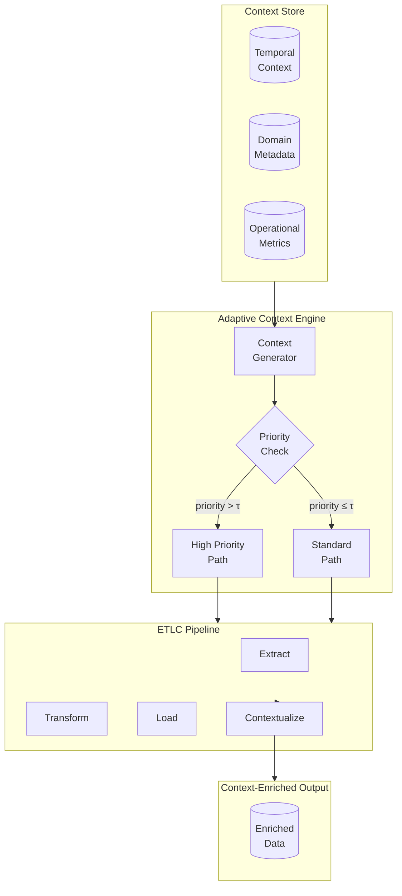

> This blog post proposes a novel concept - ETL-C, a context-first approach for building Data / AI platforms in the Generative AI dominant era. Read prior [post here](https://subhadipmitra.com/blog/2024/etlc-context-new-paradigm/).

### **Introduction: Reimagining ETL with Context**

Traditional ETL pipelines (Extract, Transform, Load) have long been the foundation of data engineering, enabling businesses to process, integrate, and analyze their data. However, as businesses grow more complex and dynamic, these pipelines face significant challenges. They often operate in rigid, static ways, failing to adapt to the nuanced, real-world context of the data they process.

That's where **ETLC** (Extract, Transform, Load, Contextualize) comes in, introducing **Context** as a fundamental addition to the ETL process. **ETLC 2.0** builds on this concept, offering three key advancements:

1. **Adaptive Context**: Pipelines that dynamically adjust their behavior based on time, external triggers, or operational metrics.
2. **Contextual Joins**: A smarter way to resolve inconsistencies and enrich relationships between datasets by leveraging semantic understanding and metadata.
3. **Context Store**: A scalable infrastructure to manage, query, and apply contextual data efficiently.

In this post, I'll walk through these ideas, sharing **technical details** and **real-world examples** that demonstrate how ETLC 2.0 can transform industries like retail banking, e-commerce, and customer analytics.

---

## **1. Adaptive Context: Making Pipelines Dynamic**

### **The Concept**

Adaptive Context gives pipelines the ability to respond dynamically to changes in time, environment, or operational conditions. Unlike static workflows, pipelines enhanced with Adaptive Context can:

- Prioritize high-value tasks during peak times.
- Adjust transformations based on external factors, like market conditions or seasonality.
- Optimize workloads based on system performance and capacity.

By embedding these signals into the pipeline, Adaptive Context ensures the system operates with real-world awareness.

---

### **Technical Framework**

Let:

- \( D \): Input dataset.
- \( M_t \): Contextual metadata at time \( t \).
- $$ \mathcal{P} $$: Pipeline transformations.

The Adaptive Context-enabled pipeline is defined as:
$$ \mathcal{P}\_{C_t}(D) = \mathcal{P}(D, C_t) $$
Where:

- \( C_t \): Active context at time \( t \), derived from $$ f(M_t, \Theta) $$, where \( f \) maps metadata \( M_t \) to actionable context, and $$ \Theta $$ represents pipeline control parameters.

Dynamic transformations:

$$
\mathcal{P}_{C_t}(D) =
\begin{cases}
f_{\text{priority}}(D) & \text{if priority}(C_t) > \tau \\
f_{\text{defer}}(D) & \text{otherwise}
\end{cases}
$$

Where $$ \tau $$ is the priority threshold.

---

### **Example: Fraud Detection in Retail Banking**

#### **Scenario**

A retail bank processes millions of credit card transactions daily. Fraud detection is particularly critical during high-risk periods like weekends or holidays when fraud incidents spike. The bank wants a pipeline that:

1. **Prioritizes** high-value transactions during peak periods.
2. **Batches** routine processing for off-hours.

#### **Implementation**

1. **Dynamic Context Generation**:

   - High-priority fraud checks during peak hours.
   - Batch fraud checks during off-hours.

2. **Real-Time Behavior**:
   The pipeline adjusts its operations based on a context signal derived from time and transaction volume.

**Code Example**:

```python
from datetime import datetime

# Define context function
def generate_context(transaction_time):
    hour = transaction_time.hour
    day = transaction_time.weekday()
    if (hour >= 9 and hour <= 18) or day in [5, 6]:  # Peak hours or weekends
        return {"priority": "high", "mode": "real-time"}
    else:
        return {"priority": "low", "mode": "batch"}

# Fraud detection pipeline
def fraud_detection(transaction, context):
    if context["priority"] == "high":
        return real_time_check(transaction)
    else:
        return batch_check(transaction)

# Execute pipeline
current_context = generate_context(datetime.now())
processed_transaction = fraud_detection(transaction_data, current_context)
```

---

## **2. Contextual Joins: Reimagining Data Relationships**

### **The Concept**

Traditional joins rely on exact key matches, which often fail when:

- Data is inconsistent (e.g., “Subhadip Mitra” vs. “S. Mitra”).
- Relationships require semantic understanding (e.g., matching similar products by description).

**Contextual Joins** solve these issues by using:

1. **Embeddings** to capture semantic similarity between keys.
2. **Metadata** to enhance joins with additional dimensions like location or time.
3. **Ontologies** to incorporate domain-specific knowledge.

---

### **Technical Framework**

For keys $$ k_1 \in D_1 $$ and $$ k_2 \in D_2 $$, the **Semantic Similarity Score** is defined as:

$$ S(k*1, k_2) $$ = $$ \alpha \cdot \text{cos}(\vec{e}*{k*1}, \vec{e}*{k_2}) + \beta \cdot M(k_1, k_2) $$

Where:

- $$ \vec{e}\_{k} $$: Embedding of key \( k \).
- $$ M(k_1, k_2) $$: Metadata-based similarity (e.g., location match, time overlap).
- $$ \alpha, \beta $$: Weights for embeddings and metadata.

A match is established if:

$$
S(k_1, k_2) > \tau
$$

---

### **Example: Unified Customer View for Retail Banking**

#### **Scenario**

A retail bank builds a **Customer 360 View** by integrating:

1. **CRM Data**: Customer profiles (e.g., “Subhadip Mitra”).
2. **Transaction Data**: Credit card logs (e.g., “S. Mitra”).
3. **Call Center Logs**: Unstructured sentiment data (e.g., comments like “I love your service!”).

#### **Implementation**

1. **Semantic Matching**:

   - Represent customer names as embeddings.
   - Compute similarity between records from CRM and transaction logs.

2. **Contextual Enhancements**:
   - Use metadata (e.g., location overlap) to refine matches.

**Code Example**:

```python
from sentence_transformers import SentenceTransformer
from sklearn.metrics.pairwise import cosine_similarity

# Datasets
names_crm = ["Subhadip Mitra"]
names_transactions = ["S. Mitra"]
locations_crm = ["New York"]
locations_transactions = ["NYC"]

# Generate embeddings
model = SentenceTransformer('all-MiniLM-L6-v2')
emb_crm = model.encode(names_crm)
emb_transactions = model.encode(names_transactions)

# Compute similarity
similarity_scores = cosine_similarity(emb_crm, emb_transactions)

# Contextual match with metadata
matches = []
for i, score in enumerate(similarity_scores[0]):
    if score > 0.8 and locations_crm[i] == locations_transactions[i]:  # Add location match
        matches.append((names_crm[0], names_transactions[i]))
print(matches)
```

---

## **3. Context Store: Operationalizing Context**

### **The Concept**

A **Context Store** is the backbone of ETLC pipelines. It stores, manages, and queries contextual metadata efficiently, enabling:

1. **Scalable Storage**: Embeddings, metadata, and ontologies.
2. **Real-Time Updates**: Ingesting and managing changing context signals (e.g., live market data).
3. **Fast Retrieval**: Providing context for dynamic pipeline operations.

---

### **Example: Personalized E-Commerce Recommendations**

#### **Scenario**

An e-commerce platform uses a Context Store to deliver dynamic, context-enriched product recommendations. It stores:

- **Customer Embeddings**: Representing browsing behavior.
- **Product Metadata**: Seasonal relevance, stock levels, and discounts.

#### **Pipeline Implementation**

1. **Store Context**:

   - Store customer and product embeddings in a vector database.

2. **Query and Enrich**:
   - Retrieve context in real-time during recommendation generation.

**Code Example**:

```python
from pinecone import Index

# Initialize vector index
index = Index("customer-context")

# Insert embeddings
customer_embeddings = [{"id": "user123", "values": [0.1, 0.2, 0.3]}]
index.upsert(customer_embeddings)

# Query for recommendations
query_embedding = [0.1, 0.2, 0.4]
results = index.query(queries=[query_embedding], top_k=3)
print("Recommended Products:", results)
```

---

### **Conclusion: ETLC 2.0 – The Future of Data Engineering**

ETLC 2.0 represents a fundamental shift in how we design and think about data pipelines. By embedding **Adaptive Context**, **Contextual Joins**, and a scalable **Context Store**, it transforms traditional workflows into intelligent, responsive systems capable of understanding and reacting to the real-world meaning of data.

This evolution is not just a technical upgrade; it is a business enabler. **ETLC 2.0** aligns data pipelines with the dynamic needs of modern enterprises, allowing organizations to:

1. **React in Real-Time**: Adaptive Context ensures pipelines evolve with shifting priorities, whether detecting fraud during peak hours or dynamically adjusting marketing campaigns.
2. **Solve Complex Data Challenges**: Contextual Joins eliminate the limitations of traditional rigid joins, enabling seamless integration across fragmented and unstructured datasets.
3. **Scale Contextual Intelligence**: The Context Store operationalizes metadata, embeddings, and domain knowledge, creating a foundation for scalable, real-time contextualization.

**Why It Matters**:  
ETLC 2.0 bridges the gap between raw data and actionable intelligence. In industries like retail banking, e-commerce, healthcare, and beyond, it empowers businesses to not just process data, but to understand and act on it in ways that were previously impossible. This is the essence of the next generation of data engineering: pipelines that **learn, adapt, and deliver insights at the speed of business**.

As businesses face increasingly complex data environments, the need for intelligent, context-driven pipelines has never been more urgent. **ETLC 2.0 is not just a framework—it's a blueprint for how organizations can thrive in a world driven by data and insights.**

**Next Steps: Putting ETLC 2.0 into Practice**:  
Start small. Experiment with contextual joins or build a pilot Context Store for a single workflow. Gradually scale the principles of ETLC 2.0 across your organization. The journey to smarter, context-aware data pipelines begins now.

Welcome to the future of data engineering. Welcome to ETLC 2.0

<br />
<br />
