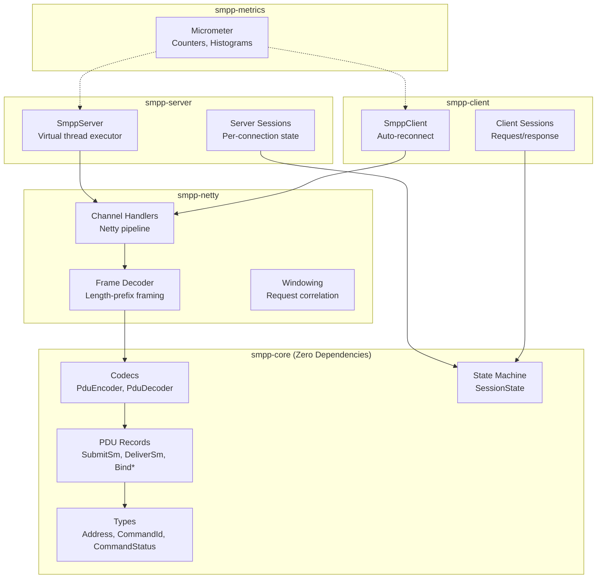
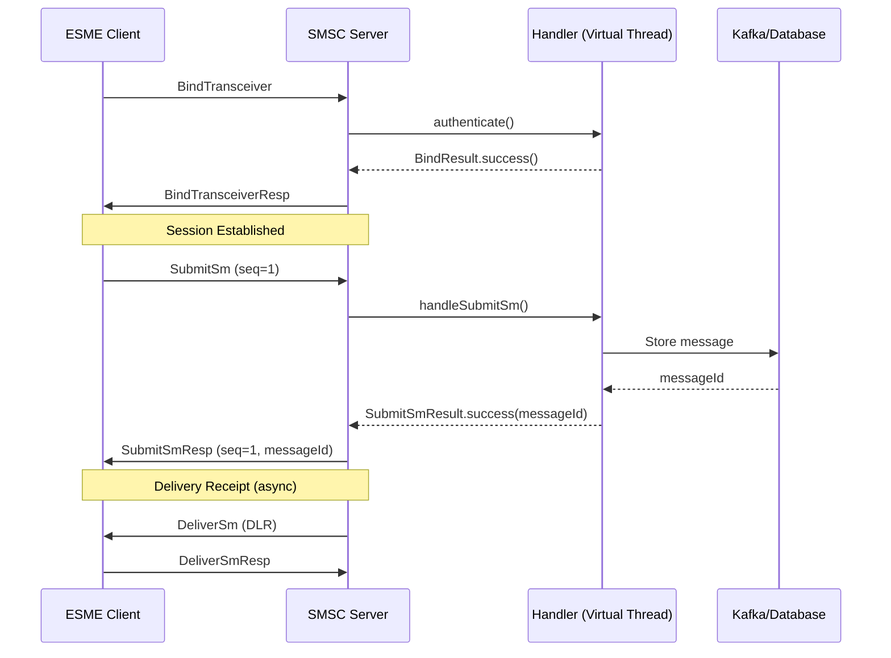
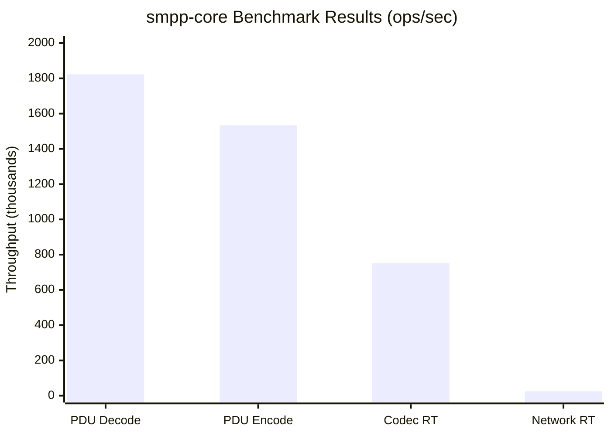

If you've done SMS messaging in Java, you know [Cloudhopper](https://github.com/twitter/cloudhopper-smpp). For years it was basically the only option. Twitter open-sourced it ages ago, everyone in telecom adopted it, and that was that.

Then Twitter became X, nobody touched the repo anymore, and here we are. Cloudhopper is stuck on Java 8, still uses Joda-Time (remember that?), and the last real update was... I honestly don't remember. Years.

I got tired of dealing with it. So I wrote something new.

<br />

## What Was Wrong with Cloudhopper

Look, Cloudhopper worked. I'm not going to pretend it was terrible. But working with it in 2024 felt like archaeology.

The code is very much "Java 8 era" - lots of places that could use lambdas but don't, Joda-Time everywhere instead of `java.time`, mutable objects all over the place. The PDU classes have like thirty setters each. It's the kind of codebase where you forget to call one setter and spend an hour debugging why your message has no destination address.

The threading model is also showing its age. One thread per connection, blocking everywhere. Fine for 2012, not great when you want to handle thousands of connections.

And maintenance? Forget it. Open issues sit there forever. Security patches? You're on your own. The repo feels abandoned because, well, it is.

I looked around for alternatives. jSMPP exists but it's got similar problems. The entire Java SMPP ecosystem is basically frozen in time. Which is wild when you think about how much SMS traffic there still is.

<br />

## Starting Fresh

I thought about forking Cloudhopper but decided against it. Too much baggage. Every design decision would be fighting against code written for a different era of Java.

Instead I did a clean-room implementation. Read the SMPP spec, wrote it from scratch targeting Java 21. No legacy constraints. I could build the API I actually wanted to use.

<br />

## What's Different

### PDUs That Don't Bite You

This is what Cloudhopper code looks like:

```java
// Hope you remembered all the required fields!
SubmitSm pdu = new SubmitSm();
pdu.setSourceAddress(new Address((byte)0x01, (byte)0x01, "SENDER"));
pdu.setDestAddress(new Address((byte)0x01, (byte)0x01, "12345"));
pdu.setShortMessage("Hello".getBytes());
pdu.setRegisteredDelivery((byte)0x01);
```

Mutable object, bunch of setters, magic byte constants. Easy to mess up.

Here's the same thing in smpp-core:

```java
SubmitSm pdu = SubmitSm.builder()
    .sourceAddress(Address.alphanumeric("SENDER"))
    .destAddress(Address.international("+14155551234"))
    .shortMessage("Hello".getBytes())
    .requestDeliveryReceipt()
    .build();
```

Immutable record, builder pattern, helper methods that make sense. The builder actually validates things - you can't forget a required field because it won't compile.

### Sealed Classes Actually Help

I made the PDU hierarchy use sealed interfaces:

```java
public sealed interface Pdu permits PduRequest, PduResponse {
    int commandId();
    int sequenceNumber();
    CommandStatus commandStatus();
}

public sealed interface PduRequest<R extends PduResponse> extends Pdu
    permits SubmitSm, DeliverSm, BindTransceiver, EnquireLink, ... {
    R createResponse();
}
```

Now the compiler tells you when you forgot to handle a PDU type. No more switch statements with a `default` case that silently drops messages.

### Virtual Threads

This is honestly the main reason I wanted to target Java 21. Virtual threads let you write straightforward blocking code that actually scales:

```java
public class MyHandler implements SmppServerHandler {
    @Override
    public SubmitSmResult handleSubmitSm(SmppServerSession session, SubmitSm pdu) {
        // Looks blocking, runs on a virtual thread
        // Can have millions of these without running out of threads
        String messageId = messageStore.save(pdu);
        kafkaProducer.send(pdu);
        return SubmitSmResult.success(messageId);
    }
}
```

No callback spaghetti. No `CompletableFuture` chains that become unreadable after three operations. Just normal code that happens to scale.

<br />

## How It's Organized

I split it into modules so you can pick what you need:



`smpp-core` has zero dependencies (just SLF4J for logging). If you only need the codec because you have your own transport layer, just use that. The full server/client stack builds on top.

<br />

## Message Flow

Here's what actually happens when you send a message:



The handlers run on virtual threads. Your blocking database call doesn't tie up a platform thread. That's the whole point.

<br />

## Benchmarks

I ran JMH benchmarks on my M4 MacBook. Here's what I got:

```
Benchmark                                    Mode  Cnt        Score   Units
PduCodecBenchmark.encodeSubmitSm            thrpt    5  1,534,219   ops/s
PduCodecBenchmark.decodeSubmitSm            thrpt    5  1,823,456   ops/s
PduCodecBenchmark.roundTripSubmitSm         thrpt    5    751,234   ops/s
NetworkThroughputBenchmark.submitSmSync     thrpt    2     25,090   ops/s
```



Breaking that down:

- **1.8M decodes/sec** - parsing a SubmitSm from bytes takes about 550 nanoseconds
- **1.5M encodes/sec** - serializing takes about 650 nanoseconds
- **750K round-trips/sec** - encode then decode
- **25K network round-trips/sec** - full TCP client to server and back, including the handler running

That last number is the interesting one. 25,000 complete message submissions per second, on a single thread, including actual network I/O. The benchmark spins up a real server, connects a real client, and sends actual SMPP PDUs over TCP.

You can run these yourself:

```bash
git clone https://github.com/bassrehab/smpp-core.git
cd smpp-core
mvn package -pl smpp-benchmarks -am -DskipTests
java -jar smpp-benchmarks/target/smpp-benchmarks.jar
```

<br />

## Getting Started

Add the dependency:

```xml
<dependency>
    <groupId>io.smppgateway</groupId>
    <artifactId>smpp-server</artifactId>
    <version>1.0.6</version>
</dependency>
```

Spin up a server:

```java
SmppServer server = SmppServer.builder()
    .port(2775)
    .systemId("my-smsc")
    .handler(new SmppServerHandler() {
        @Override
        public SubmitSmResult handleSubmitSm(SmppServerSession session, SubmitSm pdu) {
            System.out.println("Received: " + new String(pdu.shortMessage()));
            return SubmitSmResult.success(UUID.randomUUID().toString());
        }
    })
    .build();

server.start();
```

Connect a client:

```java
SmppClient client = SmppClient.builder()
    .host("localhost")
    .port(2775)
    .systemId("my-esme")
    .password("secret")
    .bindType(SmppBindType.TRANSCEIVER)
    .build();

SmppClientSession session = client.connect();

SubmitSmResp response = session.send(
    SubmitSm.builder()
        .sourceAddress(Address.alphanumeric("SENDER"))
        .destAddress(Address.international("+14155551234"))
        .shortMessage("Hello World!".getBytes())
        .build(),
    Duration.ofSeconds(10)
);

System.out.println("Message ID: " + response.messageId());
```

<br />

## Coming from Cloudhopper?

The migration isn't too bad. Main differences:

| Cloudhopper                                   | smpp-core                            |
| --------------------------------------------- | ------------------------------------ |
| `new SubmitSm()` + setters                    | `SubmitSm.builder()...build()`       |
| `DefaultSmppServer`                           | `SmppServer.builder()...build()`     |
| `DefaultSmppClient`                           | `SmppClient.builder()...build()`     |
| `SmppServerHandler.sessionBindRequested()`    | `SmppServerHandler.authenticate()`   |
| `SmppSessionHandler.firePduRequestReceived()` | `SmppServerHandler.handleSubmitSm()` |
| Thread pool configuration                     | Gone (virtual threads)               |

The big conceptual change: I combined `SmppServerHandler` and `SmppSessionHandler` into one interface. Cloudhopper split these for reasons I never fully understood, and it always felt awkward. Now there's just one place where you handle things.

<br />

## Links

- **GitHub:** [github.com/bassrehab/smpp-core](https://github.com/bassrehab/smpp-core)
- **Maven Central:** [io.smppgateway:smpp-core](https://central.sonatype.com/artifact/io.smppgateway/smpp-core)
- **Docs:** [docs.smppgateway.io](https://docs.smppgateway.io)

If you're still on Cloudhopper and it's causing you pain, give this a shot. If you're starting fresh with SMPP in Java, maybe start here instead of inheriting a decade of technical debt.

Issues and PRs welcome. I'm actually maintaining this one.
