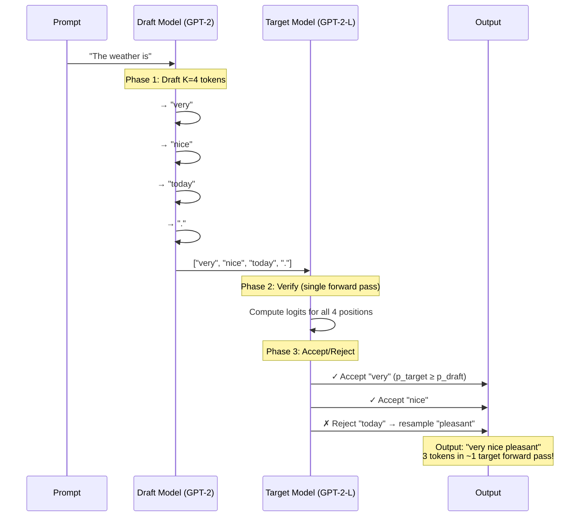
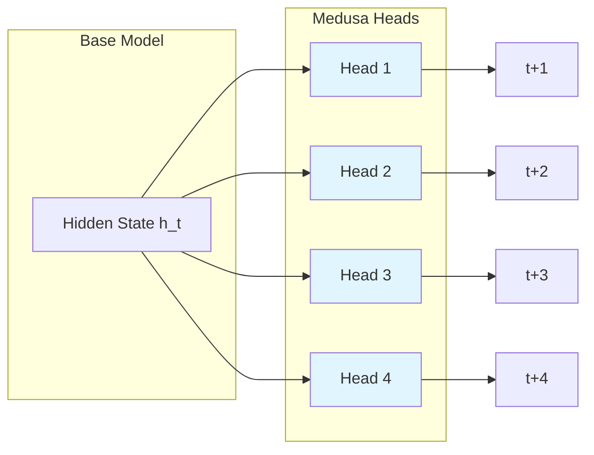
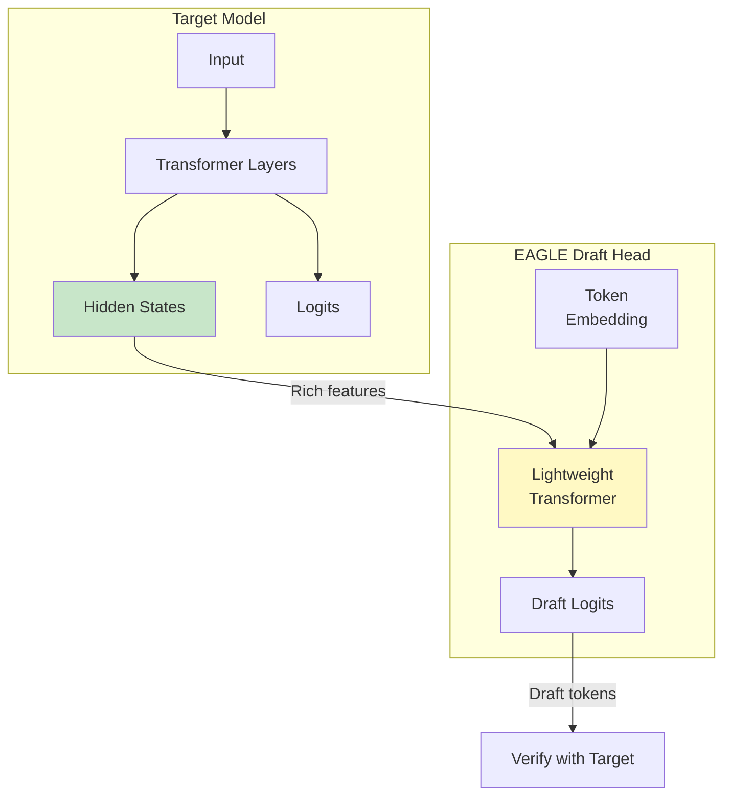

> **Update (June 2025):** Since writing this post, I've expanded the repo to cover [diffusion model efficiency](#beyond-llms-diffusion-models) as well - CFG caching, step distillation, and video latent caching. The core ideas about memory bandwidth translate surprisingly well.

> **Part 2:** If you want to go deeper on the memory-bound problem, I wrote a follow-up on [writing custom Triton kernels](/blog/2025/triton-kernels-llm-inference/) - going from 11% to 88% peak bandwidth on operations like RMSNorm.

I've been obsessing over LLM inference efficiency lately. Not the flashy stuff like new architectures or training tricks - the unglamorous work of making inference _fast_. After spending a few weeks [implementing speculative decoding from scratch](https://github.com/bassrehab/speculative-decoding), I wanted to share what I learned. This covers both intuition and implementation details.

## The Problem That Kept Bugging Me

Here's what bothered me about LLM inference: we're loading billions of parameters from memory just to generate a single token. Then we do it again. And again. For every single token.

The arithmetic doesn't make sense when you think about it. A 7B parameter model in float16 is about 14GB. On an A100 with 2TB/s memory bandwidth, just _loading_ those weights takes ~7ms. But the actual computation? Maybe 0.1ms worth of FLOPs. We're spending 98% of our time waiting for memory.

This is what people mean when they say LLM inference is "memory-bound." The GPU is mostly sitting idle, waiting for data.

### Visualizing the Bottleneck: Roofline Analysis

A roofline plot makes this concrete. The x-axis shows **arithmetic intensity** (FLOPs per byte of data moved), and the y-axis shows achievable performance. The diagonal line represents memory-bound workloads; the horizontal line represents compute-bound workloads.



The key numbers:

- **Ridge point**: ~30-150 FLOP/byte (depends on hardware)
- **LLM inference**: ~1 FLOP/byte (for FP16 autoregressive decoding)

We're **two orders of magnitude** below the ridge point. The GPU's compute units are sitting idle 98% of the time, waiting for weights to load from memory. This is why speculative decoding works - if we're paying the memory tax anyway, we might as well verify multiple tokens per load.

> For the full roofline analysis code and interactive benchmarks, see [`roofline.py`](https://github.com/bassrehab/speculative-decoding/blob/main/roofline.py) in the repo.

## The Insight Behind Speculative Decoding

The key insight from the [Leviathan et al. paper](https://arxiv.org/abs/2211.17192) is surprisingly simple: what if we could verify multiple tokens in one forward pass instead of generating them one at a time?

Think about it. If loading model weights dominates the cost, then processing 5 tokens costs almost the same as processing 1 token. We're already paying the memory bandwidth tax - might as well do more work while we're at it.

The trick is using a small "draft" model to guess what tokens the big "target" model would generate. The draft model is fast because it's small. Then we verify all those guesses in parallel with the big model. If the guesses are good, we just saved a bunch of forward passes.

## How It Actually Works

The algorithm has three phases that repeat:

**Phase 1: Draft.** Run the small model autoregressively for K tokens. This is fast because the model is tiny. I used GPT-2 (124M params) as my draft model.

**Phase 2: Verify.** Feed all K draft tokens to the big model in one forward pass. We get logits for every position.

**Phase 3: Accept/Reject.** Here's where rejection sampling comes in. For each draft token, we compare the target model's probability to the draft model's probability. Accept with probability min(1, p_target/p_draft). If we reject, resample from an adjusted distribution and stop.

Here's the flow:



The beautiful part is the math guarantees we get _exactly_ the same distribution as running the target model alone. No approximation. No quality loss. Just faster.

Here's the core loop from [my implementation](https://github.com/bassrehab/speculative-decoding/blob/main/speculative_decoding.py#L363):

```python
for i in range(k):
    draft_token = draft_tokens[i]
    p_target = target_probs[i, draft_token]
    p_draft = draft_probs[i]

    # Rejection sampling
    if random.random() < min(1, p_target / p_draft):
        accepted.append(draft_token)
    else:
        # Resample from adjusted distribution
        adjusted = torch.clamp(target_probs[i] - p_draft, min=0)
        adjusted = adjusted / adjusted.sum()
        resampled = torch.multinomial(adjusted, 1)
        accepted.append(resampled)
        break
```

## What I Found Surprising

### Greedy beats sampling (for speed)

I expected sampling mode to work fine. It doesn't - at least not for speed. With temperature sampling, the acceptance rate tanks because the draft and target models make different random choices even when their distributions are similar.

Greedy decoding gave me 1.10x speedup. Sampling gave me 0.85x (actually slower than baseline). That was counterintuitive at first, but makes sense: with greedy, if both models agree on the argmax, we accept. With sampling, we need the random draws to align too.

| Mode       | Speedup | Acceptance Rate | Notes                                                |
| ---------- | ------- | --------------- | ---------------------------------------------------- |
| Greedy     | 1.10x   | 62.5%           | Both models pick same argmax → high acceptance       |
| Sampling   | 0.85x   | 64.3%           | Random draws must align → rejection overhead         |
| Adaptive K | 0.99x   | 82.0%           | Higher acceptance, but more draft overhead per batch |

### The acceptance rate formula is elegant

The probability of accepting a draft token works out to:

$$\alpha = \sum_x \min(p(x), q(x)) = 1 - D_{TV}(p, q)$$

It's literally 1 minus the total variation distance between the two distributions. The closer your draft model is to the target, the higher your acceptance rate. Simple, but I had to work through the proof to believe it.

<details>
<summary><strong>Proof sketch (click to expand)</strong></summary>

The rejection sampling step accepts token $x$ with probability $\min(1, p(x)/q(x))$ where $p$ is target, $q$ is draft.

The overall acceptance probability is:
$$\alpha = \sum_x q(x) \cdot \min\left(1, \frac{p(x)}{q(x)}\right) = \sum_x \min(q(x), p(x))$$

This equals $1 - D_{TV}(p,q)$ by definition of total variation distance. The beautiful part: when we reject and resample from $\text{norm}(\max(0, p-q))$, the combined distribution is exactly $p$. No approximation.

For the full derivation with the expected tokens formula, see [THEORY.md](https://github.com/bassrehab/speculative-decoding/blob/main/docs/THEORY.md#the-math-why-it-works).

</details>

### KV-cache management is annoying

Nobody talks about this, but managing the KV-cache when tokens get rejected is a pain. You need to trim the cache back to the accepted length, and different models have different cache APIs. I spent more time on cache trimming than on the actual algorithm.

## Trying Different Approaches

After getting basic speculative decoding working, I implemented two variations:

### Medusa: Parallel Drafting

Instead of drafting tokens one at a time, what if we predicted multiple positions in parallel? [Medusa](https://arxiv.org/abs/2401.10774) adds extra "heads" to predict positions +1, +2, +3, etc. from the same hidden state.



The upside: one forward pass drafts multiple tokens. The downside: the heads need training, and without that, acceptance rates are terrible. My randomly-initialized heads got ~34% acceptance. Not great.

### EAGLE: Using Target Features

[EAGLE](https://arxiv.org/abs/2401.15077) is clever. Instead of using a separate draft model, it uses the target model's own hidden states to predict future tokens. The draft head sees rich features from the big model, so it makes better predictions.



I implemented a basic version with a small transformer on top of the target's hidden states. Even without training, it shows promise. The architecture makes sense - you're conditioning on information the target model already computed.

## Memory: The Other Bottleneck

While working on this, I went down a rabbit hole on KV-cache compression. For long sequences, the cache becomes massive. LLaMA-7B at 32K context needs 8+ GB just for the KV-cache.

I implemented a few compression strategies:

- **H2O eviction**: Keep "heavy hitter" tokens (high attention) plus recent tokens. Works surprisingly well.
- **Sliding window**: Keep the last N tokens plus a few "attention sink" tokens at the start.
- **INT8 quantization**: 2x memory reduction with negligible quality loss (~0.5% reconstruction error).

The combination of eviction + quantization can get you 8x compression. That's the difference between fitting in VRAM or not.

## Limitations and Honest Assessment

My benchmarks show modest speedups (1.1x) on GPT-2. That's... fine. Not amazing. Here's why:

1. **GPT-2 is small.** The draft-to-target ratio matters. GPT-2 to GPT-2-Large is only 6x. Papers showing 2-3x speedup use 70B targets with 7B drafts.

2. **MPS backend variance.** Running on my M1 Mac, I saw high variance (±10% per run). CUDA numbers are more stable.

3. **Memory bandwidth differences.** The whole premise assumes memory-bound inference. On smaller models, you might be compute-bound instead.

4. **Batch size > 1.** Speculative decoding helps most at batch size 1. With larger batches, you're already utilizing compute better (more arithmetic intensity), and the draft/verify overhead becomes less attractive. For high-throughput serving with batching, other optimizations (continuous batching, paged attention) often matter more.

If you're running LLaMA-70B on A100s, you'll see much better speedups. If you're running GPT-2 on a laptop, maybe don't bother.

## Beyond LLMs: Diffusion Models

The memory-bound insight from the [roofline analysis](#visualizing-the-bottleneck-roofline-analysis) above isn't unique to LLMs - it applies anywhere you're loading massive model weights for each forward pass. Diffusion models are a prime example: instead of one forward pass per token, you have 20-1000 denoising steps per image, each loading the full UNet weights.

I implemented a few techniques in [`diffusion_efficiency.py`](https://github.com/bassrehab/speculative-decoding/blob/main/diffusion_efficiency.py):

**CFG Caching.** Classifier-free guidance requires two forward passes per step: conditional and unconditional. But the unconditional prediction changes slowly. Cache it, reuse it every other step, and you skip ~50% of those forward passes. I measured 3.3x speedup on a toy UNet.

**Step Distillation.** The idea from [Salimans & Ho](https://arxiv.org/abs/2202.00512): train a student to match two teacher steps in one. Repeat until you're down from 1000 steps to 4. Each halving needs training, but the final model is dramatically faster.

**Video Latent Caching.** Video diffusion is brutal - every frame needs full denoising. But frames are correlated. Cache keyframes, interpolate the rest (slerp works better than linear for latent spaces), then refine with fewer steps. Same idea as I-frames and P-frames in video codecs.

These aren't as elegant as speculative decoding's rejection sampling guarantee, but they're practical. The field is moving fast here - consistency models, rectified flows, and other approaches are changing what's possible.

## What I'd Do Differently

A few things I'd change if starting over:

- **Start with bigger models.** Testing on GPT-2 was convenient but didn't show the real benefits.
- **Try tree speculation earlier.** Generating a tree of candidates instead of a single sequence is more complex but potentially faster. I implemented this in [`tree_speculation.py`](https://github.com/bassrehab/speculative-decoding/blob/main/tree_speculation.py) and it does help with acceptance rates.

## Code

Everything is on GitHub: [github.com/bassrehab/speculative-decoding](https://github.com/bassrehab/speculative-decoding)

The main files:

- `speculative_decoding.py` - Core implementation with KV-cache
- `tree_speculation.py` - Tree-based candidate exploration
- `eagle.py` - EAGLE-style feature-aware drafting
- `medusa.py` - Multi-head parallel drafting
- `kv_cache_compression.py` - Cache eviction and quantization
- `diffusion_efficiency.py` - CFG caching, step distillation, video latent caching
- `roofline.py` - Memory bandwidth profiling and roofline analysis

There's also proper documentation in [`docs/THEORY.md`](https://github.com/bassrehab/speculative-decoding/blob/main/docs/THEORY.md) if you want the full mathematical treatment, and an interactive [`demo.ipynb`](https://github.com/bassrehab/speculative-decoding/blob/main/demo.ipynb) notebook.

## Takeaways

Speculative decoding is elegant. The rejection sampling guarantee means you get exact target distribution with zero approximation - just faster. But the speedup depends heavily on your setup.

The real insight isn't the algorithm itself. It's the shift in thinking from "generate tokens sequentially" to "verify tokens in parallel." That mental model opens up a lot of optimization opportunities.

If you're working on LLM inference, understanding memory bandwidth is more important than understanding FLOPs. The bottleneck isn't compute anymore.

---

_Questions or thoughts? Feel free to reach out or open an issue on the repo._
