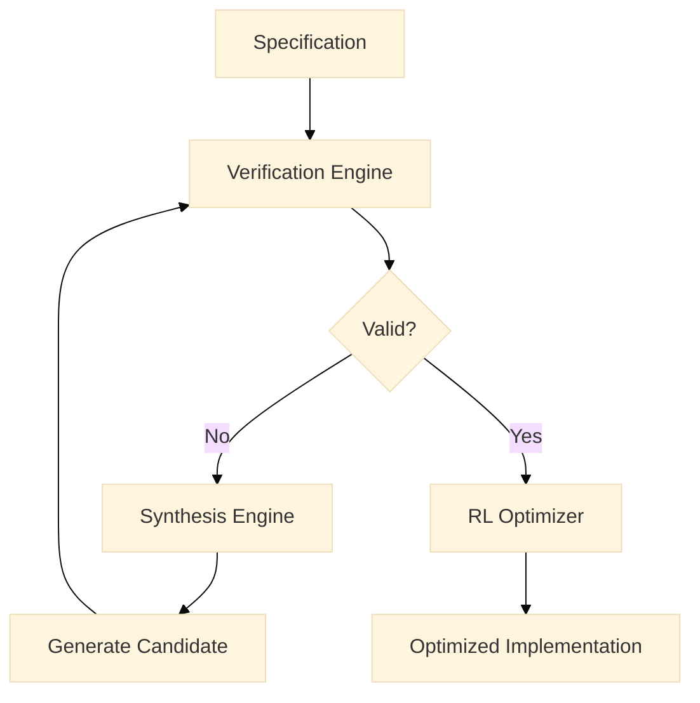
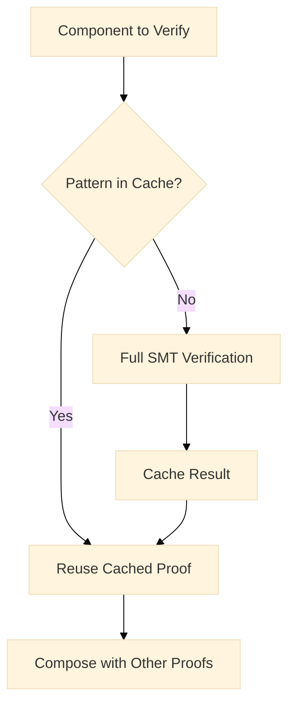
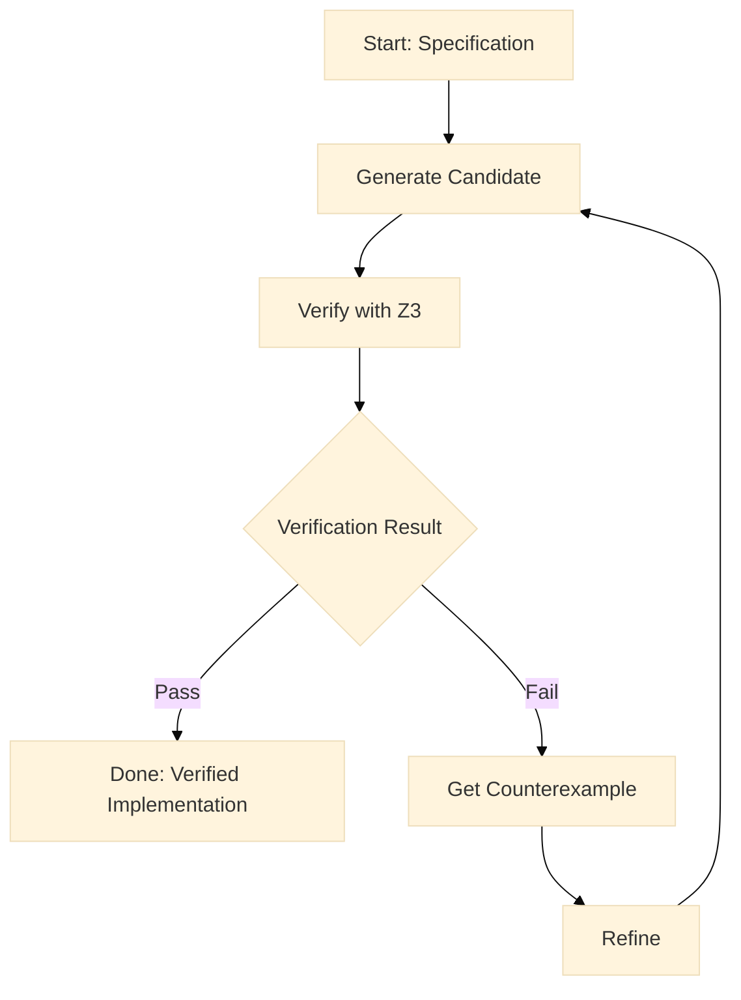

<style>
.mermaid {
    overflow-x: auto;
    overflow-y: auto;
    height: 100%;
}


.mermaid svg {
    overflow: visible;
    margin-bottom: 50px;
}
</style>

I've spent the last few months working on a problem that's been bugging me for years: why is it so hard to translate what we *want* a distributed system to do into code that actually *does* it correctly?

Last week, I published [UPIR](https://www.tdcommons.org/dpubs_series/8852/) (Universal Plan Intermediate Representation) - a framework that tries to answer this question by combining formal verification, program synthesis, and machine learning. The [code is on GitHub](https://github.com/bassrehab/upir) if you want to dive straight in.

But more than the technical details, I want to share *why* I built this and what I learned along the way.

## The Problem Nobody Talks About

Here's the thing about distributed systems: we're actually pretty good at designing them. Grab a whiteboard, sketch out some boxes and arrows, define your consistency guarantees, and you're golden. The *design* part? Solved.

The problem is what happens next.

You hand that beautiful architecture diagram to an engineering team, and three months later you're debugging why exactly the system loses data when node 3 goes down *but only if node 7 was the coordinator*. The specification said "ensure exactly-once delivery," but somewhere between the whiteboard and the code, reality happened.

I've been on both sides of this. Delivering enterprise transformations across multiple organizations, I've watched this gap trip up teams repeatedly. The traditional solutions? Not great:

- **Write it manually** - Takes forever, prone to subtle bugs in edge cases nobody thought about
- **Test exhaustively** - You'll never cover all possible race conditions, and you know it
- **Use formal verification** - Theoretically beautiful, practically explodes on anything bigger than a textbook example

What if there was a better way?

## The Core Idea

UPIR is built on a simple observation: we already have all the pieces. We know what we want (the specification). We can check if we got it right (verification). We can generate code automatically (synthesis). The problem is nobody's figured out how to make them work together at scale.

Here's my attempt.



### Part 1: Make Verification Actually Scale

Traditional formal verification tries to verify your entire system in one shot. This is why it blows up exponentially and becomes useless for real systems. UPIR does something different.

Instead of tackling the whole system, break it into components. Verify each piece independently. Then compose the guarantees. Simple in theory, tricky in practice.

The real trick is proof caching. Most distributed systems reuse the same patterns - leader election, two-phase commit, heartbeat protocols. Once you've formally verified that a leader election protocol is correct, why re-prove it every single time you see the pattern?



In my tests, this was **274x faster** for a 64-component system. Not because the math changed, but because we stopped doing the same work over and over.

### Part 2: Let Machines Generate the Code

Once you can verify things quickly, synthesis becomes interesting. Give UPIR a specification like "ensure messages are delivered exactly once," and it'll automatically generate implementation candidates.

It uses CEGIS (Counterexample-Guided Inductive Synthesis), which sounds fancy but is actually pretty intuitive:



1. Generate an implementation that might work
2. Try to verify it
3. When it fails, the verifier tells you exactly why (with a concrete counterexample)
4. Use that failure to generate a better candidate
5. Keep going until you get something provably correct

Average time? About 2 milliseconds. Success rate varies (43-75% depending on how complex the system is), but when it works, you get a formally verified implementation essentially for free.

### Part 3: Make It Fast Without Breaking It

Here's where it gets fun. Having a *correct* implementation is great, but usually it's not optimized. Traditionally, you either:
- Manually tune parameters and probably break correctness in the process
- Or accept whatever performance the synthesizer gave you and call it a day

I tried something different. What if we use machine learning to optimize performance, but use the formal verification as guardrails?

I used reinforcement learning (specifically PPO) to tune things like timeout values, buffer sizes, retry policies. The trick: the formal verification creates hard constraints. The ML optimizer can try aggressive changes, but it literally cannot violate the proven safety properties.

In practice, this gave me about **60% latency reduction** and nearly **2x throughput improvement**. Basically free performance once you've paid the verification cost.

## Why This Actually Matters

I'm not usually one for grand claims, but I think this points to something important: formal methods, synthesis, and ML are stronger together than separate.

- Formal verification gives you guarantees ML can never provide
- Synthesis bridges the specification-implementation gap automatically
- ML finds optimizations that formal methods would never consider

Each piece makes the others more useful.

## The Results (Or: Does It Actually Work?)

I ran benchmarks on a bunch of representative distributed systems patterns. Here's what I got:

| Metric | Result |
|--------|--------|
| Latency reduction | 60.1% |
| Throughput increase | 194.5% |
| Verification speedup | 274x for 64 components |
| Pattern reuse | 89.9% |
| Error rate reduction | 80% |

These aren't toy examples. These are patterns that show up in real production systems - leader election, distributed consensus, replication protocols.

## Getting Started

Want to try it yourself? UPIR is available as a Python package on PyPI:

```bash
pip install upir
```

Here's a minimal example to verify a distributed system component:

```python
from upir.core.architecture import Architecture
from upir.core.specification import FormalSpecification
from upir.core.temporal import TemporalOperator, TemporalProperty
from upir.verification.verifier import Verifier

# Define what you want: process events within 100ms
spec = FormalSpecification(
    properties=[
        TemporalProperty(
            operator=TemporalOperator.WITHIN,
            predicate="process_event",
            time_bound=100
        )
    ]
)

# Create your architecture
arch = Architecture(
    components=[...],  # your components
    connections=[...]   # how they connect
)

# Verify it
verifier = Verifier()
results = verifier.verify_specification(arch, spec)
```

**Requirements:** Python >=3.9

**Links:**
- PyPI: [pypi.org/project/upir](https://pypi.org/project/upir/)
- Documentation: [upir.subhadipmitra.com](https://upir.subhadipmitra.com)
- GitHub: [github.com/bassrehab/upir](https://github.com/bassrehab/upir)

## What's Actually In The Repo

The [GitHub repo](https://github.com/bassrehab/upir) has the full implementation if you want to poke around:

- Core framework in Python (because prototypes > perfection)
- Z3 SMT solver integration for the verification bits
- Example systems you can try it on
- Benchmarks and test suites
- Scripts to deploy on Google Cloud Run
- All the experiments backing the numbers I cited

It's not production-ready infrastructure. It's research code. But it works, and you can reproduce everything.

## What's Still Broken

Let me be honest about the limitations, because there are plenty:

**Specification complexity**: This works best when you have clean, well-defined protocols. If your spec is "make it feel fast," UPIR won't help you.

**Scope boundaries**: Some things still need manual implementation. UI code, external API integrations, the messy bits.

**Scale limits**: Systems with 1000+ components start to struggle. The compositional approach helps, but there are still limits.

**Domain transfer**: Patterns learned from data pipelines don't necessarily transfer to microservices. The clustering is domain-specific.

## Where I'm Going Next

A few directions I'm exploring:

**Dynamic systems** - Right now UPIR assumes components are static. What about systems where services join and leave dynamically?

**Cross-domain transfer** - Can we make patterns learned in one domain (say, data pipelines) work in another (like microservices)? Not sure yet.

**Edge computing** - The current approach is too heavyweight for edge devices. Can we make verification lighter weight?

**Interactive synthesis** - Let developers guide the synthesis with domain knowledge while keeping formal guarantees. Best of both worlds?

## Questions I Don't Have Answers To

I'm genuinely curious about a few things:

- What distributed systems in your domain would actually benefit from this? I've focused on the patterns I see most, but I'm probably missing stuff.

- How would this fit into real development workflows? CI/CD integration? Developer tooling? Not obvious.

- What other properties should we optimize? I focused on latency and throughput because they're measurable, but there's probably more important stuff.

- What would convince you this is actually useful vs. academically interesting? Serious question.

## Why I Actually Built This

Honestly? Frustration.

I've built enough data platforms at petabyte scale to know that the hard part isn't the design. The hard part is the implementation staying true to the design as the system evolves. Every time someone "optimizes" a critical section, you're one step closer to a subtle race condition that'll bite you in production.

The thing that made me think this might actually work: we already know what we want (requirements), we can check if we have it (formal methods), we can generate code (synthesis), and we can optimize (ML). Nobody's really tried putting all four together in a way that scales.

UPIR is my attempt. It's still research. But the numbers suggest it might be onto something.

## Get In Touch

The [full technical disclosure](https://www.tdcommons.org/dpubs_series/8852/) is on TD Commons (CC BY 4.0), and the [implementation is on GitHub](https://github.com/bassrehab/upir).

If you're working on distributed systems and want to try this on real problems, or if you're into formal verification, program synthesis, or ML for systems - let's talk. Seriously. [Email me](mailto:contact@subhadipmitra.com) or find me on [LinkedIn](https://linkedin.com/in/subhadip-mitra).

I'd especially love to hear from people who think this *won't* work. Those are usually the most useful conversations.

---

## Related Work

Some other stuff I've been working on that connects to this:

- [Field-Theoretic Context System (FTCS)](https://www.tdcommons.org/dpubs_series/8022/) - Different approach to context modeling
- [ARTEMIS](https://www.tdcommons.org/dpubs_series/7729/) - Multi-agent decision frameworks
- [ETLC](https://services.google.com/fh/files/blogs/etlc_full_paper.pdf) - Context-first data processing

---

*The code is open source, the paper is CC BY 4.0, so go nuts.*
