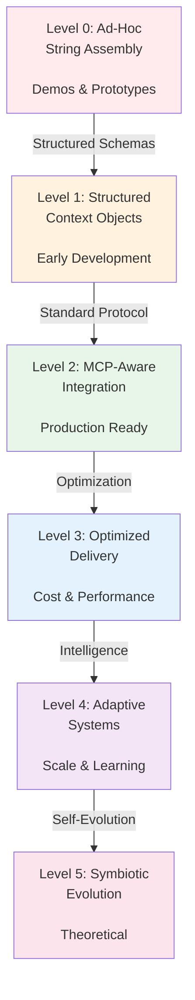
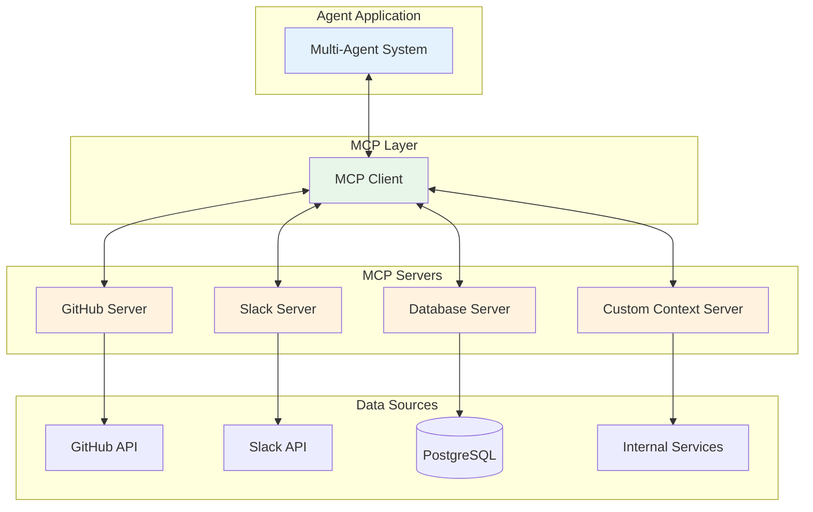
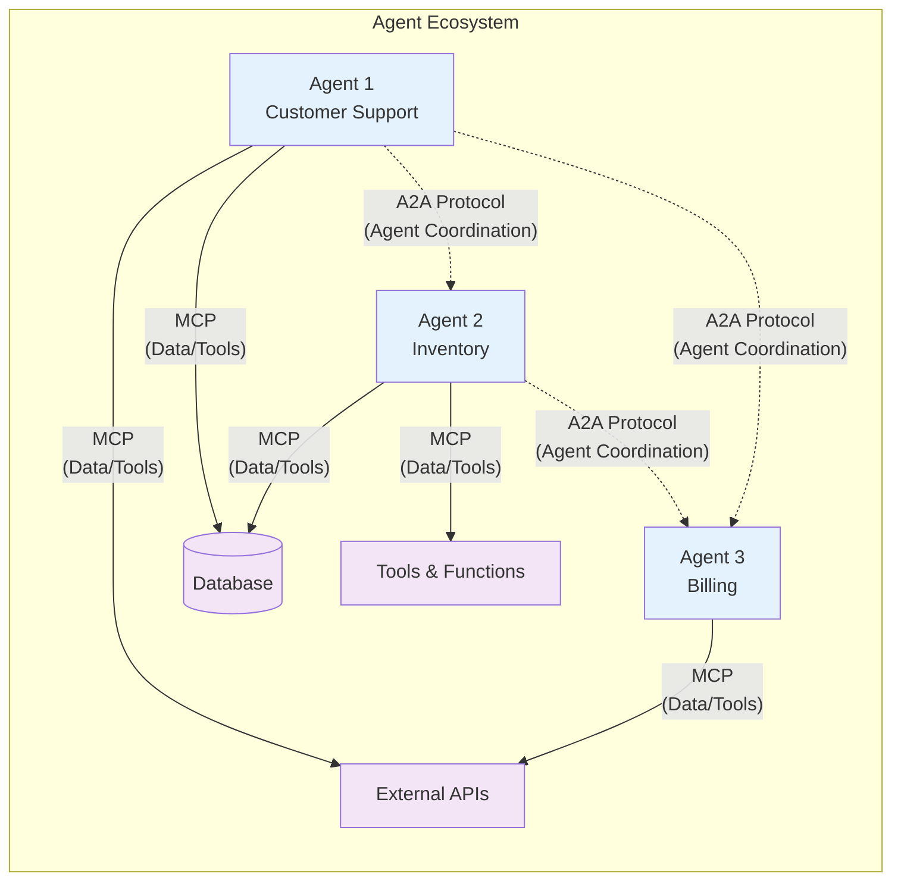

It's been nearly a year since Anthropic introduced the Model Context Protocol (MCP) in November 2024, and the landscape has shifted faster than most of us anticipated. OpenAI adopted it in March 2025. Microsoft announced at Build 2025 that MCP would become "a foundational layer for secure, interoperable agentic computing" in Windows 11. The community has built thousands of MCP servers, with adoption accelerating across the ecosystem.

But here's what nobody's talking about: most organizations still have no idea where they actually stand with context management. Teams proudly declare they're "using MCP" when they're just wrapping JSON in protocol buffers. Others build sophisticated context optimization layers while still treating agents like stateless API endpoints.

After exploring [MCP's technical architecture and implementation patterns](/blog/2025/implementing-model-context-protocol/) and analyzing how the ecosystem has evolved over the past year, I've identified six distinct maturity levels in how organizations handle context in their agent architectures. This isn't about whether you've installed an MCP server - it's about whether your context strategy will survive the next wave of agentic complexity.

Let's figure out where you are and, more importantly, where you need to be.

<br />

## Why Maturity Levels Matter Now

The agent ecosystem is fragmenting and consolidating simultaneously. LangGraph owns graph-based workflows. CrewAI dominates role-based orchestration. AutoGen leads in conversational multi-agent systems. Google's ADK (launched April 2025) is pushing bidirectional streaming with no concept of "turns." Each framework makes different assumptions about context.

Meanwhile, the problems everyone thought were solved keep resurfacing:

- **Disconnected models problem**: Maintaining coherent context across agent handoffs remains the number one failure mode in production systems
- **Contextual prioritization**: Agents drowning in irrelevant context or missing critical information
- **Cross-modal integration**: Bridging text, structured data, and visual inputs into coherent understanding
- **Context drift**: Subtle degradation of context quality over long-running sessions
- **Context rot**: Counterintuitively, model accuracy often decreases as context window size increases—more context doesn't always mean better results

You can't fix what you can't measure. This maturity model gives you a vocabulary and assessment framework for your context architecture - whether you're using MCP, a proprietary system, or (let's be honest) a mess of duct tape and hope.

<br />

## Before We Begin: Workflows vs Agents

Understanding what you're actually building shapes how sophisticated your context strategy needs to be:

**Workflows** (predictable, predetermined paths):

- Prompt chaining, routing, parallelization
- Steps are known upfront
- Easier to debug and optimize
- **Most business problems are workflows**, not agents
- Simpler context management often suffices

**Agents** (dynamic, model-driven decision-making):

- Best for open-ended problems where steps cannot be pre-determined
- Require extensive testing in sandboxed environments
- Higher complexity, harder to debug
- Benefit from sophisticated context strategies

Anthropic's guidance: "Many use cases that appear to require agents can be solved with simpler workflow patterns." If you can map out the steps in advance, you probably want a workflow, not an agent. Keep this distinction in mind as we explore the maturity levels—workflows typically need less sophisticated context management than true agents.

<br />

## The Six Levels of Context Maturity

I'm structuring this from Level 0 (where most projects start) to Level 5 (the theoretical limit of current approaches). Each level represents a fundamental shift in how you think about and implement context management.



<br />

### Level 0: Ad-Hoc String Assembly

**What it looks like:**

You're building prompts through string concatenation or f-strings. Context is whatever you manually stuffed into the system message. Agent-to-agent communication happens through return values or shared global state. You're probably using a single LLM call per operation.

```python
# This is Level 0
context = f"User said: {user_input}\nPrevious: {history[-1]}"
response = llm.call(context)
```

**Characteristics:**

- No standardized context format
- Manual prompt engineering for every interaction
- Context lost between agent calls
- No visibility into what context was used for decisions
- Testing requires copy-pasting prompts into ChatGPT

**Why teams stay here:**

It works for demos. Seriously - you can build impressive prototypes at Level 0. The pain only hits when you try to debug why your agent hallucinated customer data or when you need to add a third agent to the conversation.

**Anti-patterns that emerge:**

- Hardcoding complex, brittle logic directly in prompts
- Stuffing exhaustive edge cases into system messages
- Providing vague guidance assuming shared context with the model
- Copy-pasting successful prompts without understanding why they worked

These problems compound rapidly as complexity grows. What worked for a demo becomes unmaintainable in production.

**Migration blocker:**

The realization that "just one more if statement" isn't going to fix context coordination across three asynchronous agents hitting different data sources.

<br />

### Level 1: Structured Context Objects

**What it looks like:**

You've graduated to using dictionaries, JSON objects, or dataclasses for context. There's a schema - even if it's just implied. You're probably using Pydantic for validation. Agents pass structured data instead of strings.

```python
# Level 1
from pydantic import BaseModel

class Context(BaseModel):
    user_input: str
    session_id: str
    history: list[dict]
    metadata: dict

context = Context(
    user_input=user_input,
    session_id=session.id,
    history=get_history(),
    metadata={"source": "web"}
)
```

**Characteristics:**

- Defined context schemas (even if informal)
- Validation of context structure
- Serialization for storage/transmission
- Some level of context versioning
- Shared context objects across codebase

**Capabilities unlocked:**

You can now log context in a queryable format. Debugging improves 10x because you can see what data was available. You can start building unit tests around context transformations.

**Common pitfalls:**

| Pitfall                                  | What Happens                                             | How to Avoid                                                                   |
| ---------------------------------------- | -------------------------------------------------------- | ------------------------------------------------------------------------------ |
| Over-engineering schemas upfront         | 50-field context objects where 40 fields are always null | Start small, evolve incrementally based on actual usage                        |
| Creating separate schemas per agent type | Loss of interoperability across agents                   | Define shared base context, extend with agent-specific fields only when needed |
| No schema versioning                     | Breaking changes cascade across system                   | Version schemas from day one, even if just comments                            |

<br />

**Assessment criteria:**

- Do you have a written schema for your context? (doesn't have to be formal)
- Can you serialize/deserialize context reliably?
- Can a developer understand what's in context without debugging?

**When to level up:**

When you're building multi-agent systems and spending more time writing context transformation code than business logic. When debugging requires tracking context mutations across multiple service boundaries.

<br />

### Level 2: MCP-Aware Integration

**What it looks like:**

You've adopted MCP (or an equivalent standardized protocol). You're using the official SDKs. Context flows between agents using protocol-defined messages. You might be running MCP servers for your data sources.

This is where OpenAI, Microsoft, and thousands of other organizations landed in 2025. You're following the standard, using the primitives (resources, prompts, tools), and getting benefits from ecosystem tooling.

```python
# Level 2 - actual MCP usage
from mcp import Server, Resource

server = Server("data-context")

@server.resource("user-profile")
async def get_user_context(uri: str) -> Resource:
    user_id = uri.split("/")[-1]
    profile = await fetch_user_profile(user_id)
    return Resource(
        uri=uri,
        name=f"Profile for {user_id}",
        mimeType="application/json",
        text=json.dumps(profile)
    )
```

**Characteristics:**

- Using MCP protocol for context exchange
- Standardized resource/prompt/tool interfaces
- Compatible with ecosystem tools (Claude Desktop, Zed, Replit, etc.)
- Context can be inspected with standard tooling
- Multi-provider support (not locked to one LLM vendor)



<br />
<br />

**Capabilities unlocked:**

This is where things get interesting. You can swap MCP servers without rewriting agent code. You get observability from MCP-aware tooling. Your agents can discover available context sources at runtime. You're benefiting from community-built servers for common data sources (GitHub, Slack, Google Drive, Postgres, etc.).

**Capabilities unlocked in practice:**

Early MCP adopters report significant improvements in integration velocity—adding new data sources to agent systems in hours or days instead of weeks. The standardization pays off when you need to scale integrations.

**Common mistakes:**

| Mistake                                                 | Why It's Wrong                                                                          | Better Approach                                                                                            |
| ------------------------------------------------------- | --------------------------------------------------------------------------------------- | ---------------------------------------------------------------------------------------------------------- |
| Treating MCP as just another API wrapper                | You're missing the point - MCP enables ecosystem interoperability and runtime discovery | Embrace protocol-native patterns: resource discovery, prompt templates, standardized tools                 |
| Not leveraging resource discovery                       | Static configuration defeats MCP's dynamic capabilities                                 | Let agents discover available context sources at runtime                                                   |
| Implementing every context source as a custom server    | Wasting time reinventing wheels; missing ecosystem benefits                             | Use community MCP servers first (GitHub, Slack, Postgres, etc.); only build custom for proprietary sources |
| Ignoring MCP's prompt primitives                        | Only using resources leaves powerful features on the table                              | Explore prompt templates for reusable context patterns                                                     |
| Under-investing in tool/server design                   | Poor tool design causes model errors and frustration                                    | Budget serious time for clear interfaces, good error messages, thoughtful constraints                      |
| Creating bloated tool sets with ambiguous functionality | Makes agent selection harder; consumes context window space unnecessarily               | Keep tools focused and well-defined; split ambiguous tools into specific ones                              |

<br />

**Critical insight on tool design:**

When Anthropic built their SWE-bench agent (December 2024), they discovered something surprising: **they spent more time optimizing tools than the overall prompt**. Small details matter enormously - for example, requiring absolute filepaths instead of relative paths prevented an entire class of model errors.

The takeaway: MCP server design is not a "just make it work" afterthought. Well-designed tools with clear interfaces, good error messages, and thoughtful constraints are what separate production-grade systems from prototypes. Budget serious time for this.

**Assessment criteria:**

- Are you using MCP (or equivalent standard) for agent-to-agent context?
- Can your agents discover available context sources?
- Are you using ecosystem tooling for development/debugging?
- Could you swap your LLM provider without major context rewrites?

**Migration path from Level 1:**

Start with MCP clients for context consumption before building servers. Wrap your existing structured context in MCP resource responses. Gradually migrate context sources to dedicated servers. The transition can be incremental.

<br />

### Level 3: Optimized Context Delivery

**What it looks like:**

You're not just passing context - you're actively optimizing what context gets passed and how. You've implemented semantic tagging, context compression, intelligent caching, and performance monitoring. You understand that not all context is created equal.

This is where production teams start actually measuring context costs and making data-driven optimization decisions.

**The fundamental insight: Context Rot**

Anthropic's research (September 2025) on context engineering revealed something counterintuitive: **model accuracy decreases as context window size increases**. More context doesn't mean better results - it means degraded performance.

The transformer architecture creates n² pairwise token relationships, causing a finite attention budget. Like human working memory, LLMs have limited capacity to effectively process information. The goal isn't maximizing context - it's finding **"the smallest possible set of high-signal tokens that maximize the likelihood of the desired outcome."**

This principle drives everything at Level 3: aggressive filtering, compression, and prioritization aren't optional optimizations - they're fundamental to agent performance.

**Characteristics:**

- Semantic tagging for context relevance
- Compression and summarization for large contexts
- Multi-tier caching (L1: hot context, L2: warm, L3: cold)
- Context cost tracking (token usage, latency)
- Performance metrics per context source
- **Active context reduction** (not just addition)

**Capabilities unlocked:**

You can now answer questions like "which context source contributes most to our LLM costs?" and "what's the cache hit rate on customer profile lookups?" You're making intelligent tradeoffs between context freshness and latency.

**Techniques teams use at this level:**

| Technique                  | What It Does                                                                             | Example Use Case                                                                                                             |
| -------------------------- | ---------------------------------------------------------------------------------------- | ---------------------------------------------------------------------------------------------------------------------------- |
| **Semantic routing**       | Tag context with relevance scores and filter based on agent task                         | Customer support agent gets recent tickets (high relevance) but not full account history (low relevance for password resets) |
| **Context compression**    | Use smaller models to summarize lengthy context before passing to primary agent          | Condense 50-page product manual to 2-paragraph summary for Q&A agent                                                         |
| **Intelligent caching**    | Distinguish hot (session), warm (user), and cold (global) context with appropriate TTLs  | User preferences cached for session, account data for hours, product catalog for days                                        |
| **Lazy loading**           | Fetch context on-demand rather than preloading everything                                | Only pull transaction history if agent determines it's needed                                                                |
| **Compaction**             | Periodically summarize conversation histories and reinitialize with compressed summaries | After 50 messages, summarize conversation state into 5 key points. Prevents context window bloat in long sessions.           |
| **Structured note-taking** | External memory systems (NOTES.md, STATE.json) outside context window                    | Research agent builds knowledge graph externally, queries it selectively. Track complex tasks without consuming tokens.      |

<br />

**Advanced pattern: Code execution with MCP**

For agents working with hundreds or thousands of tools, Anthropic's engineering team (November 2025) demonstrated an advanced optimization: present MCP servers as **code APIs** instead of direct tool calls.

Traditional approach problem:

- Tool definitions consume massive context window space
- Intermediate results pass through the model repeatedly
- Example: Retrieving a Google Drive transcript and attaching to Salesforce = 150,000 tokens (the transcript flows through the model twice)

Code execution approach:

- Agent explores filesystem-based tool structure
- Loads only needed tool definitions
- Processes data in execution environment
- Returns only final results to model

**Impact**: 150,000 tokens → 2,000 tokens (98.7% reduction)

**Bonus benefits**:

- Sensitive data stays in execution environment (privacy)
- State persists across operations via file storage
- Agents can save reusable code functions

This pattern becomes essential when scaling to many tools (typically 50+ tools or when working with data-heavy operations). You're essentially giving agents a programming environment rather than a function-calling interface. Note that this optimization technique remains valuable at Level 4 and beyond—it's introduced at Level 3 because that's when token costs become a critical concern that drives architectural decisions.

**Real challenges at this level:**

Balancing context freshness vs. cost is tricky. Teams often cache aggressively to save on LLM costs only to have agents work with stale data. Or the opposite - fetching everything fresh and blowing their inference budget.

The optimization game changes based on your agent architecture. Streaming agents (like Google ADK's turnless approach) need different strategies than request-response agents.

**Assessment criteria:**

- Are you measuring context cost (tokens, latency, freshness)?
- Do you have caching with intentional TTL strategies?
- Can you identify which context sources are underutilized?
- Do you compress/summarize context before transmission?

**When you know you're ready for Level 4:**

When optimization becomes reactive fire-fighting instead of systematic improvement. When your caching strategy can't keep up with dynamic agent behavior. When you're manually tuning context delivery for each new agent type.

<br />

### Level 4: Adaptive Context Systems

**What it looks like:**

Your context system learns and adapts based on agent behavior. You're using vector databases for semantic similarity. Context delivery adjusts dynamically based on agent performance. The system predicts what context an agent will need before it asks.

This is where AgentMaster (introduced July 2025) and similar frameworks are heading - using vector databases and context caches not just for storage but for intelligent retrieval.

**Characteristics:**

- Vector databases for semantic context retrieval
- Context usage analytics feeding back into delivery
- Predictive context pre-fetching
- Dynamic context window management
- A/B testing of context strategies

**Capabilities unlocked:**

Agents get better context over time without manual intervention. New agent types automatically benefit from learned context patterns. You can answer "which context combinations lead to highest task completion rates?"

**Architectural patterns:**

| Pattern                     | How It Works                                                                                                                     | Benefits                                                                                               | Example                                                                                                            |
| --------------------------- | -------------------------------------------------------------------------------------------------------------------------------- | ------------------------------------------------------------------------------------------------------ | ------------------------------------------------------------------------------------------------------------------ |
| **Semantic memory layer**   | Vector database storing historical interactions with embeddings                                                                  | Retrieve contextually similar past conversations; surface relevant examples without keyword matching   | Customer support agent recalls similar issue resolutions from past tickets                                         |
| **Context feedback loops**  | Track which context led to successful vs. failed agent actions; down-weight failures, prioritize successes                       | Improves context quality over time based on actual outcomes                                            | System learns that recent transaction history predicts successful fraud detection                                  |
| **Predictive pre-fetching** | Use initial agent state to predict likely context needs; pre-load high-probability sources                                       | Reduces latency for common paths                                                                       | E-commerce agent pre-fetches inventory when user mentions products                                                 |
| **Dynamic windowing**       | Adjust context window size based on task complexity; simple queries get minimal context, complex reasoning gets expanded         | Prevents both under and over-contextualization; optimizes token usage                                  | Simple FAQ gets 500 tokens, complex legal analysis gets 50k tokens                                                 |
| **Sub-agent architectures** | Coordinator agent delegates to specialized sub-agents with minimal, task-specific context; sub-agents return condensed summaries | Prevents context pollution across task domains; works well with agent-to-agent communication protocols | Research coordinator → citation finder (clean context) + data analyst (clean context) + summarizer (clean context) |

<br />

**Real-world tradeoffs:**

The infrastructure complexity jumps significantly. You need vector databases, analytics pipelines, and feedback loops. Based on the systems I've observed, teams typically invest 3-6 months building Level 4 capabilities from scratch.

The payoff comes at scale. If you're handling thousands of agent sessions daily, adaptive systems justify their complexity. For lower-volume use cases, you're better off perfecting Level 3.

**Assessment criteria:**

- Are you using vector databases for context retrieval?
- Does context delivery improve based on agent performance data?
- Can your system predict context needs before explicit requests?
- Do you have analytics showing context effectiveness?

**Common failure mode:**

Over-optimization for historical patterns. Your adaptive system learns that "customer support agents always need recent tickets" and pre-fetches them, then breaks when you introduce a billing agent with different needs. Guard rails matter.

<br />

### Level 5: Symbiotic Context Evolution

**What it looks like (theoretically):**

Context schemas evolve based on agent needs. The boundary between "agent" and "context system" blurs. Context sources coordinate with each other. The system exhibits emergent optimization behaviors that weren't explicitly programmed.

I'm calling this theoretical because production systems haven't fully achieved Level 5 yet, though elements appear in research systems and at the edges of advanced deployments.

**Characteristics (aspirational):**

- Self-evolving context schemas
- Cross-agent context learning
- Coordinated context source optimization
- Emergent context delivery strategies
- System-wide context coherence guarantees

**What this might look like:**

An agent working on customer onboarding discovers it needs "account risk score" context that doesn't exist. Instead of failing, the system:

1. Identifies existing context sources that could contribute to risk scoring
2. Synthesizes a new composite context type
3. Makes it available to other agents
4. Learns when risk scores are vs. aren't valuable

This requires agents that can reason about their own context needs, a context system that can safely compose new context types, and coordination mechanisms that prevent chaos.

**Why we're not there yet:**

**Safety**: Self-evolving schemas are terrifying in production. One bad evolution and your agent system is down.

**Coherence**: Maintaining semantic consistency across evolved schemas is an unsolved problem.

**Debuggability**: When context delivery is emergent behavior, root cause analysis becomes extremely difficult.

**Cost**: The meta-learning required to achieve this is expensive in LLM calls.

**Current research directions:**

- Category theory approaches for provable context composition (mentioned in recent AAMAS 2025 papers)
- Reinforcement learning for schema evolution with safety bounds
- Formal verification of context transformations

**Assessment:**

If you can honestly answer yes to these, you're at Level 5:

- Do context schemas evolve without human intervention?
- Can agents safely compose new context types at runtime?
- Does your system learn context patterns across agent types?
- Do you have formal guarantees about context coherence?

Most organizations shouldn't aim for Level 5 yet. The juice isn't worth the squeeze unless you're operating at massive scale with research resources.

<br />

## Where Should You Be?

Here's my honest take based on what works in practice:

**First principle: Start simple.**

Anthropic's engineering team (December 2024) emphasizes that "the most successful implementations use simple, composable patterns rather than complex frameworks." Many teams over-engineer solutions when optimizing a single LLM call would suffice. Don't jump to Level 4 adaptive systems when Level 2 MCP integration solves your actual problem.

The right level depends on your scale and complexity. Remember the workflows vs agents distinction from earlier—**workflows typically need Levels 0-2**, while **true agents benefit from Levels 3-4**:

| Scale / Context                       | Target Level | Why                                                                                 | Key Considerations                                                                              |
| ------------------------------------- | ------------ | ----------------------------------------------------------------------------------- | ----------------------------------------------------------------------------------------------- |
| **Prototype or MVP**                  | Level 1      | Structured context objects give you enough flexibility and debuggability            | Don't over-engineer; focus on validating product-market fit                                     |
| **Production < 1k daily sessions**    | Level 2      | Standardization pays off immediately in development velocity and ecosystem benefits | You'll thank yourself when you need to add integrations; use community MCP servers              |
| **Scaling to thousands of sessions**  | Level 3      | Context costs become real budget line items                                         | Caching and compression aren't optional - they're necessary for unit economics                  |
| **Serious scale (10k+ sessions/day)** | Level 4      | Infrastructure investment justified by cost savings and quality improvements        | Need vector databases, analytics pipelines; 3-6 month build time                                |
| **Research or hyperscale**            | Level 5      | Cutting-edge experimentation                                                        | Unless you're at Google/Microsoft scale, learn from research and cherry-pick techniques instead |

<br />

## Practical Assessment Framework

Here's how to figure out where you actually are (be honest):




**Ad-Hoc String Assembly**

Answer these yes/no:

- [ ] Context is mostly strings or free-form dictionaries
- [ ] Agent coordination happens through shared variables or return values
- [ ] Debugging requires reading code to understand context structure
- [ ] Adding a new agent type requires rewriting context handling

**Result:** If you answered yes to 3+, you're at Level 0. That's okay - it's where everyone starts.

**Next step:** Define structured context schemas (move to Level 1)



**Structured Context Objects**

- [ ] You have defined context schemas (Pydantic, dataclasses, TypeScript interfaces)
- [ ] Context can be serialized reliably
- [ ] You can log context in queryable format
- [ ] Multiple agents share common context types

**Result:** 3+ yes → You're at Level 1

**Next step:** Adopt MCP or standard protocol (move to Level 2)



**MCP-Aware Integration**

- [ ] Using MCP or equivalent standard protocol
- [ ] Agents can discover available context sources
- [ ] Compatible with ecosystem tooling
- [ ] Could swap LLM providers without major context rewrites

**Result:** 3+ yes → Level 2

**Next step:** Implement caching and optimization (move to Level 3)



**Optimized Delivery**

- [ ] Measuring context costs (tokens, latency)
- [ ] Multi-tier caching with intentional TTL strategies
- [ ] Context compression or summarization
- [ ] Performance metrics per context source

**Result:** 3+ yes → Level 3

**Next step:** Add adaptive systems with vector DBs (move to Level 4)



**Adaptive Systems**

- [ ] Vector databases for semantic context retrieval
- [ ] Context delivery improves based on performance data
- [ ] Predictive context pre-fetching
- [ ] Analytics showing context effectiveness

**Result:** 3+ yes → Level 4

**Next step:** Research Level 5 approaches (experimental)



**Symbiotic Evolution**

- [ ] Context schemas evolve without human intervention
- [ ] Agents safely compose new context types at runtime
- [ ] System learns context patterns across agent types
- [ ] Formal guarantees about context coherence

**Result:** 4+ yes → Level 5 (Congratulations! You're at the cutting edge)

**Note:** Most organizations shouldn't aim for Level 5 yet. Focus on perfecting Level 4.




<br />

## Migration Paths

The good news: you can level up incrementally. Here's how.




**Structured Context**

**Time investment**: 1-2 weeks for typical multi-agent system

**Steps**:

1. Define your current implicit context as explicit schemas
2. Add Pydantic models or equivalent validation
3. Replace string building with structured object construction
4. Add context logging with structured format

**What to watch out for**:

- Don't try to model everything upfront
- Start with the context that crosses agent boundaries
- Version your schemas from day one (even if just comments)

**Success criteria**: Can serialize/deserialize context reliably, context is queryable



**MCP Adoption**

**Time investment**: 2-4 weeks

**Steps**:

1. Start with MCP clients consuming existing context
2. Identify context sources that have community MCP servers
3. Wrap custom context sources as MCP servers
4. Gradually migrate to MCP resource/prompt patterns

**What to watch out for**:

- Don't rewrite everything at once
- Start with read-only context sources (lower risk)
- Use community servers where available (don't reinvent)

**Resource**: The official MCP SDKs (Python, TypeScript, Go) are production-ready. Start with the Python SDK if you're prototyping.

**Success criteria**: Agents discover context sources at runtime, ecosystem tooling works



**Optimization**

**Time investment**: 4-8 weeks

**Steps**:

1. Add context cost tracking (instrument your MCP servers)
2. Implement caching for high-frequency, low-change context
3. Add semantic tagging to context resources
4. Build compression layer for large context sources
5. Monitor and iterate

**What to watch out for**:

- Don't optimize prematurely (you need data first)
- Watch cache invalidation - it's harder than it looks
- Test with production traffic patterns, not synthetic load

**Success criteria**: 20-40% reduction in LLM costs, measurable cache hit rates



**Adaptive Systems**

**Time investment**: 3-6 months

**Steps**:

1. Deploy vector database (Pinecone, Weaviate, pgvector)
2. Build context usage analytics pipeline
3. Implement semantic similarity retrieval
4. Add feedback loops from agent outcomes to context delivery
5. Deploy predictive pre-fetching for common patterns

**What to watch out for**:

- Infrastructure complexity increases substantially
- Need robust analytics before adaptive systems make sense
- Start with one agent type, prove value, then expand

**Success criteria**: Context delivery improves based on data, predictive pre-fetching reduces latency



**Symbiotic Evolution (Experimental)**

**Time investment**: Research-level effort (6+ months)

**Recommendation**: Most organizations should **not** attempt this migration yet. Instead:

- Perfect Level 4 capabilities
- Monitor research developments
- Cherry-pick specific techniques (e.g., RL for caching policies)

**If you must proceed**:

1. Implement formal verification for context transformations
2. Build safe schema evolution with rollback mechanisms
3. Deploy multi-agent context learning with safety bounds
4. Establish coherence guarantees across context types

**What to watch out for**:

- Production safety is extremely challenging
- Debugging emergent behavior is hard
- Cost of meta-learning can be prohibitive

**Success criteria**: Context schemas evolve safely, measurable improvement in agent performance




<br />

## The Hard Questions

Let me address what people actually want to know:

**"Should I use MCP or build something custom?"**

Use MCP unless you have a very specific reason not to. The ecosystem effects are real - community servers, tooling support, talent familiarity. Teams waste months building custom context protocols that are strictly worse than MCP.

Exception: If you're deeply embedded in a vendor ecosystem (AWS Bedrock with their agent framework, Google Vertex with their approach), use what's native to your platform. Fighting the platform is expensive.

<br />

**"What about LangGraph/CrewAI/AutoGen's context handling?"**

These frameworks have their own context patterns. LangGraph uses graph state, CrewAI has crew context, AutoGen has conversational memory. They're not incompatible with MCP - you can use MCP servers as data sources within these frameworks.

Think of it this way: MCP handles context **retrieval and delivery**. LangGraph/CrewAI/AutoGen handle context **usage and orchestration**. They're different layers.

<br />

**"What about A2A (Agent2Agent protocol)? Is that competing with MCP?"**

No, they're complementary. Google announced A2A in April 2025 (donated to Linux Foundation in June) to handle agent-to-agent communication, while MCP handles agent-to-data/tool communication.

Think of it as:

- **MCP**: How agents access context, tools, and resources (vertical integration)
- **A2A**: How agents talk to and coordinate with each other (horizontal integration)

AgentMaster (July 2025) was the first framework to use both protocols together - A2A for agent coordination and MCP for unified tool/context management. This is likely the future pattern: A2A for inter-agent messaging, MCP for resource access.

From a maturity perspective, A2A becomes relevant at Level 3+ when you have multiple specialized agents that need to coordinate. Before that, you're likely working with simpler orchestration patterns.



<br />

**"Is vector database mandatory for production?"**

No. Plenty of Level 3 systems run without vector databases and do fine at moderate scale. Vector databases become valuable when:

- You have significant historical interaction data to learn from
- Semantic similarity matters more than exact matches
- You're retrieving context across heterogeneous sources

For transaction processing or structured data lookups, traditional databases work great.

<br />

**"What's the actual cost difference between levels?"**

Hard to generalize, but based on patterns I've observed across teams at different maturity levels:

| Migration     | Infrastructure Cost Impact      | LLM Cost Impact                          | Development Velocity Impact  | Time Investment |
| ------------- | ------------------------------- | ---------------------------------------- | ---------------------------- | --------------- |
| **Level 0→1** | Minimal increase                | No change                                | 50% faster debugging         | 1-2 weeks       |
| **Level 1→2** | +10-20% (MCP servers)           | No change                                | 30-40% faster integrations   | 2-4 weeks       |
| **Level 2→3** | +10-15% (caching infra)         | -20-40% (with good caching)              | Ongoing optimization         | 4-8 weeks       |
| **Level 3→4** | +30-50% (vector DBs, analytics) | Variable (enables optimization at scale) | Initial slowdown, then gains | 3-6 months      |

Your mileage will vary dramatically based on architecture.

<br />

## What's Next for Context Management?

Based on what I'm seeing in research and early production systems:

**Formal verification of context transformations**: We need mathematical guarantees that context hasn't been corrupted or misused as it flows through agent systems. Category theory approaches are promising but not production-ready.

**Context provenance tracking**: Being able to trace where every piece of context came from and how it was transformed. Critical for debugging and compliance. MCP doesn't have strong primitives for this yet.

**Cross-modal context unification**: Bridging text, structured data, images, and code into coherent context remains messy. Most systems treat these as separate context types.

**Energy-aware context delivery**: As agent systems scale, context retrieval and transmission energy costs become significant. We'll need optimization strategies that balance quality vs. environmental impact.

**Context security and isolation**: Multi-tenant agent systems need strong isolation guarantees. Current approaches are ad-hoc. Expect to see formal security models emerge.

<br />

## Final Thoughts

A year ago, most teams were at Level 0 wondering if they should even care about context management. Today, with OpenAI and Microsoft committed to MCP, thousands of production servers, and frameworks like AgentMaster pushing adaptive approaches, the question isn't "if" but "how sophisticated does my context strategy need to be?"

The maturity model I've outlined isn't prescriptive - it's descriptive of emerging patterns in the ecosystem. Your path might look different. What matters is being intentional about your context architecture instead of letting it emerge accidentally.

Where are you today? Where do you need to be in six months? The gap between those answers is your roadmap.

If you're building multi-agent systems and want to dig deeper into implementation details, I wrote about [implementing MCP in production systems](/blog/2025/implementing-model-context-protocol/) earlier this year. For broader architectural context, my series on [SARP (Symbiotic Agent-Ready Platforms)](/blog/2025/agent-ready-data-platforms-sarp/) explores how data platforms need to evolve for the agentic era.

For practical guidance from Anthropic's engineering team, I highly recommend:

- [Building Effective Agents](https://www.anthropic.com/engineering/building-effective-agents) - Essential reading on the workflows vs agents distinction and why simplicity wins
- [Code Execution with MCP](https://www.anthropic.com/engineering/code-execution-with-mcp) - Deep dive on the code execution pattern for scaling to many tools
- [Effective Context Engineering for AI Agents](https://www.anthropic.com/engineering/effective-context-engineering-for-ai-agents) - Foundational research on context rot and optimization techniques that directly informed this maturity model

The context revolution is here. The question is whether you're ready for it.

---

_What level is your organization at? What challenges are you facing in your context architecture? I'm curious to hear from practitioners working on these problems. Find me on [LinkedIn](https://www.linkedin.com/in/subhadip-mitra/) or drop a comment below._
