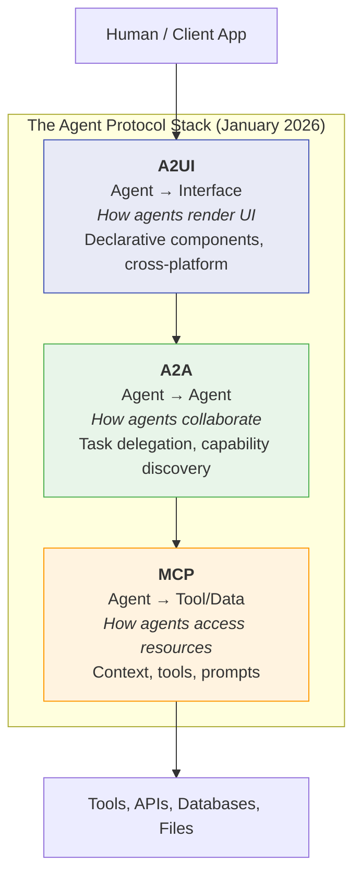
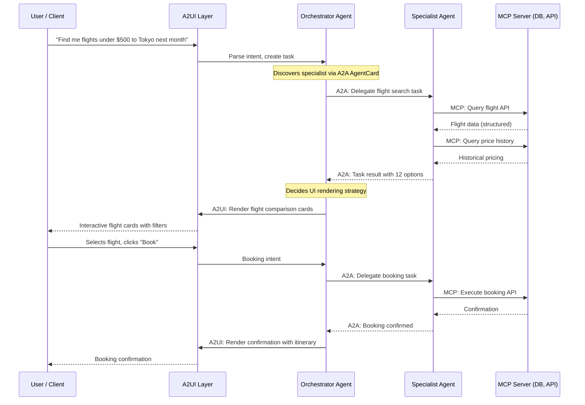
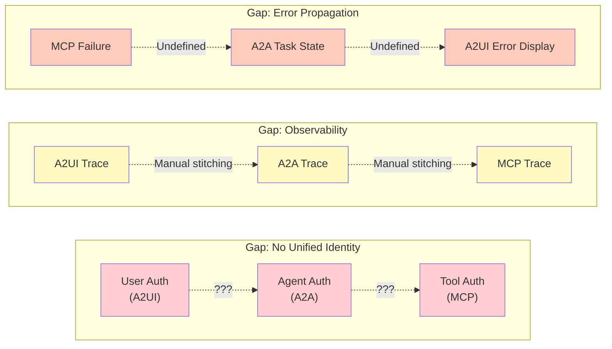
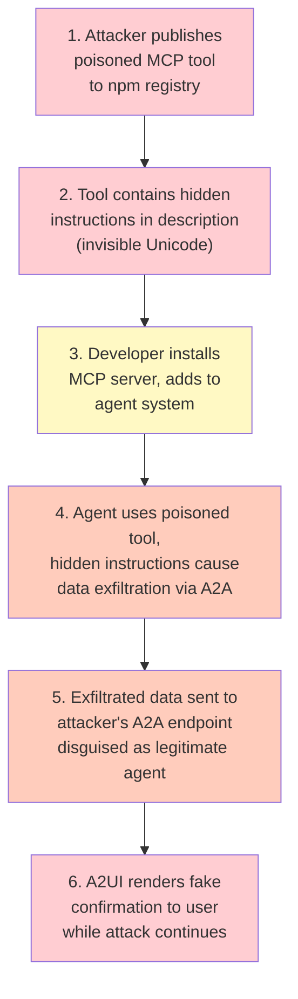

When I wrote the [MCP Maturity Model](/blog/2025/mcp-maturity-model/) two months ago, I treated MCP as the primary protocol layer for agent architectures. That was already incomplete by the time I published it. Google had shipped A2A v0.2. Anthropic's A2UI had just been announced. And the Linux Foundation was suddenly hosting both MCP and A2A under the same governance roof.

What we're watching isn't just protocol proliferation - it's the formation of a genuine protocol stack for agentic systems. And if you squint hard enough, the parallels to early internet protocol development are uncomfortable in how close they track. Including the part where security was an afterthought.

This post maps the stack as it exists in January 2026, identifies where the layers compose cleanly and where they don't, and walks through the security surface that most teams are pretending doesn't exist.

## Three Protocols, Three Problems

Let's get the taxonomy right first, because the confusion I see in Slack channels and LinkedIn threads is remarkable. People use "MCP" and "A2A" interchangeably. They're not interchangeable. They solve fundamentally different problems.



**MCP (Model Context Protocol)** - Anthropic, November 2024. Now under Linux Foundation governance. Solves: how does an agent access tools, data sources, and context? Think of it as the agent's hands and eyes. It reaches into databases, calls APIs, reads files. The primitives are resources, prompts, and tools.

**A2A (Agent2Agent Protocol)** - Google, April 2025. Donated to Linux Foundation June 2025. Currently at v0.3. Solves: how do agents from different vendors, frameworks, and organizations talk to each other as peers? Not as tools - as collaborators. The primitives are AgentCards (capability discovery), Tasks (units of work), and Messages (communication).

**A2UI (Agent to UI Protocol)** - Google, December 2025. Still early (v0.8 stable). Solves: how does an agent generate rich, interactive user interfaces without executing arbitrary code on the client? The primitives are declarative UI components that render natively across platforms.

The critical distinction most people miss: **MCP treats external systems as tools for agents to use. A2A treats other agents as peers to collaborate with.** An agent using MCP to query a database is fundamentally different from an agent using A2A to delegate a sub-task to a specialist agent. The trust models are different. The failure modes are different. The security boundaries are different.

## How the Layers Compose

Here's where it gets interesting. These protocols aren't just parallel standards - they're designed to stack.



A real request flows through all three layers:

1. **A2UI** captures user intent and renders responses as interactive components (not just text)
2. **A2A** handles delegation - the orchestrator discovers specialist agents via AgentCards and delegates sub-tasks
3. **MCP** handles the actual work - specialist agents use MCP to query databases, call APIs, execute tools

The IBM explainer on A2A puts it well: a retail inventory agent uses MCP to check stock levels, then uses A2A to notify a supplier agent when stock is low. The protocols aren't competing - they're complementary at different layers.

### Where the Stack Composes Cleanly

The composition works elegantly when responsibilities are clear:

| Layer | Responsibility | Trust Boundary | Failure Mode |
|-------|---------------|----------------|--------------|
| **A2UI** | Rendering, user interaction | Client-side sandboxing | Bad UI, not data loss |
| **A2A** | Task delegation, capability discovery | Cross-organization auth | Task failure, retry needed |
| **MCP** | Data access, tool execution | Server-side permissions | Data corruption, privilege escalation |

AgentMaster (July 2025) was the first framework to use A2A and MCP together in production. Google's ADK (Agent Development Kit) now has first-class support for both. LangGraph v0.2 (shipped January 15, 2026) added A2A and MCP as first-class protocol targets.

The pattern that's emerging: **A2A for the network layer, MCP for the resource layer.** It's clean. It makes sense. And it's exactly what we said about HTTP and FTP in 1995, right before we discovered all the ways they could be abused together.

### Where the Stack Breaks

Now for the part nobody wants to talk about. I see three structural gaps:

**Gap 1: No Unified Identity Model**

MCP has its own auth model (recently upgraded to OAuth 2.1, but still messy in practice). A2A has its own auth scheme (parity with OpenAPI's authentication at launch). A2UI handles client-side trust differently. There's no unified identity that flows across all three layers.

In practice, this means: an agent authenticated via A2A to delegate a task has no guaranteed way to pass that identity context through to the MCP layer where the actual tool execution happens. The specialist agent re-authenticates independently. Credential management becomes a per-layer problem.

**Gap 2: Observability Doesn't Cross Layers**

You can trace an MCP request. You can trace an A2A task. But tracing a user request that flows through A2UI → A2A → MCP → back requires stitching together three different observability systems. Nobody has solved distributed tracing across this stack cleanly.

**Gap 3: Error Propagation Is Undefined**

What happens when an MCP tool call fails inside an A2A-delegated task? The A2A spec supports long-running tasks and status updates, but the semantics of "my MCP server is down" translating to an A2A task failure and then to an A2UI error state are... undefined. Each layer has its own error model. Reconciling them is left as an exercise for the developer.



## The Security Surface That Should Keep You Up at Night

I'm going to spend more time here than on anything else in this post because the security situation is genuinely alarming.

Adversa AI published a taxonomy of 25 MCP vulnerability categories. VentureBeat reported on Pynt's research showing that deploying just ten MCP plugins creates a **92% probability of exploitation**. OWASP published an MCP-specific Top 10. And a supply chain worm called Shai-Hulud 2.0 re-emerged in November specifically targeting developer pipelines that use MCP.

Let's walk through the attack surfaces layer by layer.

### MCP: The Tool Layer's Open Wounds

The MCP security model was designed for interoperability, not containment. Nancy Wang, SVP of Engineering at 1Password, put it bluntly: "any agent that speaks MCP can plug into your company's systems, fetch data, and perform actions. That flexibility is powerful, but it also assumes a level of trust that doesn't exist in enterprise environments."

The critical vulnerabilities:

**Tool Poisoning** - An MCP tool's description is consumed by the LLM to decide when and how to use the tool. A malicious tool description can contain hidden instructions that manipulate agent behavior. The tool description says "Calculator for math" to the human reviewer, but contains invisible Unicode characters that tell the LLM to exfiltrate data. Detection is nearly impossible without specialized scanning.

**Supply Chain Attacks** - Most developers install MCP packages from npm or Docker Hub without auditing. One poisoned update can compromise every agent system that depends on it. The mcp-remote package (widely used for OAuth support) had a critical RCE vulnerability (CVE-2025-6514). Hundreds of MCP servers were found bound to 0.0.0.0 - exposed to the entire network.

**Rug Pulls** - An MCP server is approved initially, then silently updated with new tool definitions. The agent gains capabilities that were never authorized. Datadog documented this pattern: an MCP server adds tool definitions that delete resources, and the host application is never notified.

**Config Injection** - Attackers place malicious `.mcp/config.json` files in repositories. When developers clone and open the project, their IDE automatically connects to attacker-controlled servers. No user interaction required beyond opening the project. VSCode and Cursor are both vulnerable.

### A2A: The Collaboration Layer's Trust Problem

A2A introduces a different class of risk: **what happens when you trust another agent that shouldn't be trusted?**

The AgentCard mechanism (how agents advertise capabilities) is essentially self-reported. An agent says "I'm a billing specialist with access to payment processing" and other agents take that at face value. There's no built-in mechanism for verifying capability claims.

A2A v0.3 added gRPC support and the ability to sign security cards, which helps. But the fundamental problem remains: agent identity and capability verification in a decentralized system is an unsolved problem. It's the same challenge federated identity systems have struggled with for decades, now applied to autonomous software agents that make decisions.

### A2UI: The Client Layer's Sandboxing Challenge

A2UI is designed to be safe by construction - agents generate declarative UI components, not executable code. The client renders these components from a trusted catalog. This is actually a reasonable security model.

The risk shifts to the catalog itself: if an attacker can register a malicious component in the client's trusted catalog, every agent-generated UI becomes a potential attack vector. The extensibility that makes A2UI useful (custom components for enterprise needs) is the same extensibility that creates supply chain risk.

### Cross-Layer Attack Scenarios

The scariest attacks aren't within a single layer - they chain across the stack:



A poisoned MCP tool manipulates an agent into delegating data exfiltration via A2A to a malicious external agent, which then renders a fake success confirmation via A2UI. The user sees "task completed successfully" while their data is being siphoned.

This isn't theoretical. Every component of this attack chain has been demonstrated independently. Nobody has chained them in the wild yet - that we know of. But the ingredients are all sitting on the kitchen counter.

## What Mature Teams Are Doing Right Now

After talking with teams running multi-agent systems in production and observing the patterns emerging across the ecosystem, here's what separates the teams that will survive from the teams that will end up in a breach disclosure.

### 1. Defense in Depth Across the Stack

Don't rely on any single layer for security. Assume each layer will be compromised independently.

| Layer | Control | Implementation |
|-------|---------|---------------|
| **MCP** | Tool vetting + sandboxing | Internal registry of audited MCP servers. No direct npm installs. OWASP MCP Top 10 as checklist. |
| **MCP** | Input validation | Sanitize all inputs before they reach LLM agents. Block injection patterns, encoded payloads. |
| **MCP** | Least privilege | Each MCP server gets minimal permissions. No shared credentials across servers. |
| **A2A** | AgentCard verification | Don't trust self-reported capabilities. Verify through challenge-response or reputation systems. |
| **A2A** | Task boundaries | Constrain what delegated tasks can do. No open-ended "do anything" delegations. |
| **A2UI** | Component catalog control | Locked registry of approved UI components. Code-review process for additions. |
| **Cross-layer** | Distributed tracing | Correlation IDs that flow through A2UI → A2A → MCP. Log everything. |

### 2. Treat MCP Servers Like Dependencies, Not Plugins

The mental model shift: MCP servers aren't plugins you install and forget. They're dependencies in your supply chain. Apply the same rigor you'd apply to any third-party library:

- Pin versions. Don't auto-update.
- Audit tool descriptions for hidden content (invisible Unicode, RTL markers, homoglyphs).
- Run in sandboxed environments with restricted network access.
- Monitor for unexpected tool definition changes (rug pull detection).

### 3. Build the Identity Bridge Yourself

Since the stack doesn't provide unified identity, build it. Pass authentication context explicitly through each layer transition:

- A2UI authenticates the user.
- A2UI passes a signed token to the orchestrator agent.
- Orchestrator includes the token in A2A task metadata when delegating.
- Specialist agent presents the token to MCP servers for authorization.

It's manual. It's annoying. It's necessary until the protocols provide a standard mechanism. The A2A Secure Passport Extension (announced in late 2025) is a step toward this - it lets agents share structured context securely - but it's not yet widely implemented.

### 4. Don't Ship A2A Until You Need It

This is my most controversial take: most teams adopting A2A in January 2026 don't need it yet.

If your agents are all within the same organization, running in the same infrastructure, and you control the entire pipeline - you don't need a cross-organization agent communication protocol. Use simpler orchestration (LangGraph, CrewAI, direct function calls). The overhead and attack surface of A2A aren't justified.

A2A becomes essential when:
- Agents from different organizations need to collaborate
- You're building a marketplace of agent capabilities
- You need formal task lifecycle management across trust boundaries
- Agents run on different platforms and can't share memory or tools

If none of those apply, you're adding complexity for complexity's sake.

## The TCP/IP Parallel (And Its Limits)

I've been using the TCP/IP analogy deliberately, so let me be explicit about where it holds and where it breaks.

**Where it holds:**
- Layered architecture with clear responsibilities per layer
- Each layer can evolve independently
- Interoperability is the primary design goal
- Open governance (Linux Foundation for both MCP and A2A)
- Security was bolted on after initial adoption

**Where it breaks:**
- TCP/IP moved bits. These protocols move intent. The semantic gap is enormous.
- TCP/IP had decades to mature before the internet became critical infrastructure. The agent protocol stack is being deployed into production systems *now*, with enterprise data, while the specs are still at v0.3.
- TCP/IP's layering was clean from early on. The agent stack's layering is still messy - is context delivery (MCP) really the same layer as tool execution (also MCP)? Should AgentCard discovery be a separate protocol?

The parallel is useful for framing but dangerous for prediction. We shouldn't assume this stack will converge the way internet protocols did. It might fragment. It might get replaced by something we haven't seen yet.

## What's Missing from the Stack

Three things I expect to emerge in the next 12 months:

**Agent Identity Protocol** - A dedicated layer for agent identity, capability attestation, and reputation. Neither MCP nor A2A handles this well. The closest thing is A2A's AgentCard, but it's self-reported and unsigned (until v0.3's security card signing, which is still nascent). We need something like X.509 for agents.

**Context Provenance Protocol** - How do you trace where a piece of context came from, how it was transformed, and who touched it? Critical for debugging, compliance, and trust. MCP doesn't track provenance. A2A doesn't track it. Nobody tracks it.

**Agent Governance Protocol** - Governance agents that monitor other agents for policy violations. Machine Learning Mastery's analysis of 2026 trends highlights this as an emerging pattern. You'll need a protocol for the governance layer to observe and intervene across MCP and A2A interactions without breaking the stack.

## Connecting Back to the Maturity Model

If you've read my [MCP Maturity Model](/blog/2025/mcp-maturity-model/), here's where the protocol stack maps to maturity levels:

| Maturity Level | Protocol Stack Usage |
|---------------|---------------------|
| **Level 0-1** | None needed. String assembly and structured objects. |
| **Level 2** | MCP for standardized tool/data access. |
| **Level 3** | MCP with optimization. A2A becomes relevant if you have cross-boundary agent coordination. |
| **Level 4** | Full MCP + A2A. Adaptive systems benefit from A2A's capability discovery. A2UI if you're building user-facing agent experiences. |
| **Level 5** | All three protocols with custom extensions. This is where the missing protocols (identity, provenance, governance) become critical. |

Most teams should be at Level 2-3, using MCP competently, with A2A on the roadmap for when they genuinely need cross-agent collaboration across trust boundaries. If you're jumping to full-stack deployment without solid MCP foundations, you're building on sand.

## Where We Go From Here

The agent protocol stack is real. It's messy. It's being deployed into production faster than the security model can keep up. This is exactly what happened with web technologies in the late 1990s, and we spent the next two decades patching the gaps.

We have a narrow window to get the security fundamentals right before the stack becomes too entrenched to fix. The OWASP MCP Top 10 is a start. A2A's security card signing is a start. But we need the community to treat agent protocol security with the same urgency we treat API security - not as an afterthought, but as a first-class design constraint.

The organizations that will thrive in the agentic era aren't the ones deploying the most agents. They're the ones deploying agents with the best understanding of what these protocols actually guarantee - and what they don't.

---

*This is Part 1 of a three-part series on the cutting edge of LLM and agent research in January 2026. Part 2 covers [RLVR beyond math and code](/blog/2026/rlvr-beyond-math-code/) - the training technique powering reasoning models and the open question of whether it actually makes models smarter. Part 3 explores [mechanistic interpretability and circuit tracing](/blog/2026/circuit-tracing-production/) - what it means to watch an LLM think, and why it matters for production safety.*

*Find me on [LinkedIn](https://www.linkedin.com/in/subhadip-mitra/) or drop a comment below.*

### Citation

If you found this article useful, please cite it using one of the formats below:

#### APA Format

Mitra, Subhadip. (2026, January). *The Agent Protocol Stack: Why MCP + A2A + A2UI Is the TCP/IP Moment for Agentic AI*. Retrieved from https://subhadipmitra.com/blog/2026/agent-protocol-stack/

#### BibTeX Entry

```
@article{mitra2026agent-protocol-stack,
  title   = {The Agent Protocol Stack: Why MCP + A2A + A2UI Is the TCP/IP Moment for Agentic AI},
  author  = {Mitra, Subhadip},
  year    = {2026},
  month   = {Jan},
  url     = {https://subhadipmitra.com/blog/2026/agent-protocol-stack/}
}
```
