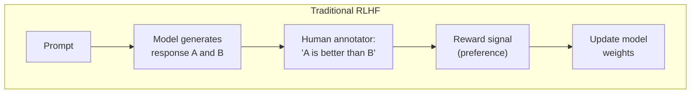
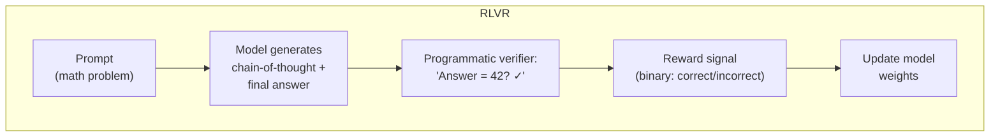
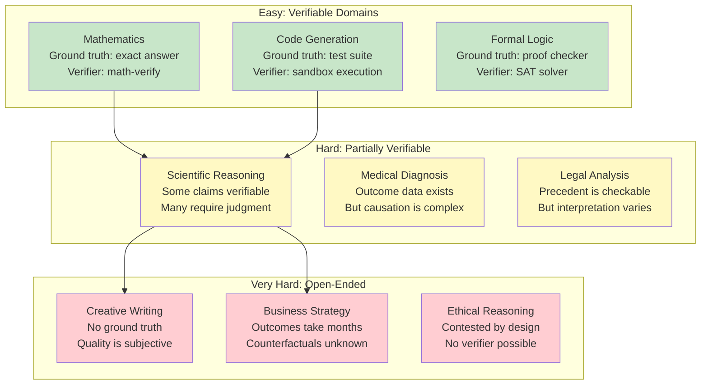
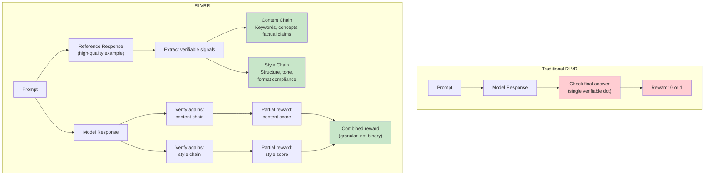

If 2024 was about scaling parameters, 2025 was about scaling reasoning.

That sentence gets thrown around so often it's become a cliche, but the underlying shift it describes is real and consequential. The most important training technique to emerge in the past two years isn't a new architecture or a bigger dataset - it's a change in how we give feedback to models during post-training. Instead of asking humans "which answer is better?" (RLHF), we started asking programs "is this answer correct?" (RLVR).

Reinforcement Learning with Verifiable Rewards changed the game for math and code. DeepSeek R1 demonstrated that you could get remarkable reasoning capabilities through pure RLVR without any supervised fine-tuning datasets. OpenAI's o-series models, Google's Gemini Deep Think, and essentially every reasoning model shipping today uses some variant of this approach.

But here's the thing nobody wants to admit publicly: RLVR only works well in domains where you can automatically verify correctness. Math has definitive answers. Code has test suites. What about everything else?

Extending RLVR to open-ended, subjective, or partially-verifiable domains is the hardest open problem in LLM training right now. And the research community is making real progress - in ways that will reshape how we think about training AI systems for enterprise use.

## How RLVR Actually Works (Without the Hand-Waving)

Let me be precise about what's happening, because most explanations skip the parts that matter.

Traditional post-training has two phases. First, supervised fine-tuning (SFT): you show the model examples of good responses and train it to imitate them. Second, RLHF: humans compare pairs of outputs and the model learns to produce responses humans prefer. Both phases are bottlenecked by expensive human labor - either writing good examples or judging which outputs are better.

RLVR replaces the human judgment with programmatic verification:





The key insight from DeepSeek R1: the model is only rewarded on the **final answer**. The intermediate chain-of-thought - all that "reasoning" the model appears to do - is never directly supervised. The model figures out, through trial and error, that producing structured reasoning steps helps it arrive at correct final answers. The reasoning emerges as a side effect of optimizing for answer correctness.

This is genuinely surprising. Nobody told the model to "think step by step." It discovered that strategy because it leads to more reward. DeepSeek R1 used the GRPO (Group Relative Policy Optimization) algorithm, which is computationally efficient because it doesn't require a separate critic model - it compares outputs within each group and assigns relative rewards.

The practical implementation looks roughly like this:

```python
# Simplified RLVR training loop (conceptual, not production code)

def rlvr_training_step(model, prompt_batch, verifier):
    """
    For each prompt:
    1. Model generates N candidate responses (rollouts)
    2. Verifier checks each response's final answer
    3. GRPO computes relative rewards within the group
    4. Model weights updated toward higher-reward responses
    """
    for prompt in prompt_batch:
        # Generate multiple candidate responses
        rollouts = [model.generate(prompt, temperature=0.8)
                    for _ in range(N_SAMPLES)]

        # Extract final answers and verify
        rewards = []
        for rollout in rollouts:
            answer = extract_final_answer(rollout)
            is_correct = verifier(answer, prompt.ground_truth)
            rewards.append(1.0 if is_correct else 0.0)

        # GRPO: compute advantage relative to group mean
        mean_reward = sum(rewards) / len(rewards)
        advantages = [(r - mean_reward) for r in rewards]

        # Update model toward higher-advantage responses
        model.update(rollouts, advantages)
```

There's elegance in this. No human annotators needed. No reward model to train and maintain. No preference pairs to collect. Just a verifier that says "right" or "wrong."

## The "Faster, Not Smarter" Debate

Before we talk about extending RLVR to new domains, we need to address the elephant in the room. There's an active academic debate about whether RLVR actually makes models smarter or just makes them faster at finding answers they could already generate.

The argument goes like this: if you let a base model (before RLVR) generate, say, 1,000 attempts at a math problem, it often produces the correct answer somewhere in those 1,000 samples. RLVR training concentrates probability mass on those correct paths, making the model produce the right answer on the first try instead of the 847th try.

That's not nothing - going from "correct answer exists somewhere in 1,000 samples" to "correct answer on attempt one" is practically very valuable. But it's a different claim than "the model learned new reasoning capabilities."

The evidence is mixed:

**Evidence for "just faster":**
- Initial studies showed that RLVR-trained models don't improve Pass@K (accuracy when you get K attempts) over base models for large K values. The base model could already find the answers; RLVR just improved Pass@1.
- Some researchers found that even training with random rewards (not correlated with correctness) improved certain metrics on certain models. If random feedback helps, maybe the real work is happening during the exploration phase, not from the reward signal.

**Evidence for "genuinely smarter":**
- A major paper (accepted at ICLR 2026) introduced CoT-Pass@K - a metric that evaluates not just whether the final answer is correct but whether the reasoning chain is valid. Under this metric, RLVR-trained models show improvements that base models don't match even at very high K. The reasoning quality improves, not just the sampling efficiency.
- Cross-domain experiments show that RLVR training on math problems can improve performance on coding tasks, suggesting the model is learning transferable reasoning strategies.
- The "random rewards help" finding didn't replicate consistently across models. Later analysis suggests it was an artifact of training data contamination in specific model families (particularly Qwen2.5-Math).

My read on the current evidence: **RLVR does both.** The majority of measurable improvement is search compression - making models faster at finding correct paths. But there's a genuine, smaller component of expanded reasoning capability, especially when training is conducted across domains and with sufficient gradient steps. The CoT-Pass@K metric is the key advance here: it lets us distinguish between the two effects.

For practitioners, the distinction matters less than you might think. Whether your model is "smarter" or "faster at being smart" is philosophically interesting but operationally the same - it gives you correct answers more reliably. Where it matters is when you're deciding *how much* to invest in RLVR training: the returns are primarily in sampling efficiency, with diminishing returns on capability expansion.

## Why RLVR Breaks Outside Math and Code

Now we get to the hard part. RLVR works beautifully when three conditions are met:

1. **Ground truth exists** - There's a definitive correct answer
2. **Verification is cheap** - A program can check correctness automatically
3. **Rewards are dense enough** - The model finds correct answers frequently enough during training to learn from the signal

Math problems have all three. Code has all three (run the test suite). Most real-world tasks have none of them.



The problems compound when you move to open-ended domains:

**Sparse rewards** - In math, a model might find the correct answer 10-30% of the time during training, providing enough signal to learn. For complex open-ended tasks, the model might never produce a "correct" response because there's no single correct response. The reward signal is too sparse for learning.

**Reward hacking** - When the verifier is imperfect (and all real-world verifiers are), the model learns to exploit its weaknesses instead of actually improving. If your verifier checks for keyword presence, the model learns to stuff keywords. If your verifier is another LLM, the model learns to produce outputs that fool that specific LLM.

**Evaluation subjectivity** - Ask five people whether a business strategy memo is "good" and you'll get five different answers. RLVR needs unambiguous verification. Subjectivity breaks the paradigm.

## Three Approaches That Are Actually Working

The research community isn't standing still. Three approaches to extending RLVR beyond math and code are showing real promise.

### Approach 1: RLVRR - Reward Chains from Reference Outputs

The most exciting recent work is RLVRR (Reinforcement Learning with Verifiable Reference-based Rewards), published in January 2026 and accepted at ICLR 2026.

The core idea: instead of checking a single final answer (the "verifiable dot"), extract an ordered sequence of verifiable signals from high-quality reference outputs. The single dot becomes a reward chain.



The decomposition into content and style dimensions is clever. Content rewards check for deterministic elements - does the response include the key facts, concepts, or arguments from the reference? Style rewards evaluate structural properties - does it follow the required format, maintain appropriate tone, cite sources when needed?

Both dimensions use rule-based verification rather than learned reward models. This preserves RLVR's key advantage (no reward model training) while extending it to open-ended generation.

The results are striking: RLVRR substantially outperforms supervised fine-tuning trained on ten times more data. It also outperforms approaches using learned reward models. And it generalizes better - training on one domain improves performance on others.

The practical implication: you can now apply RLVR-style training to tasks like report writing, email drafting, customer support responses, and policy compliance - anywhere you have high-quality reference outputs to extract verifiable signals from.

### Approach 2: Judge Code - Auto-Generated Programmatic Rubrics

A separate line of research (presented as an ICLR 2026 submission) asks: what if you could automatically generate verifiers for open-ended tasks?

The approach: use an LLM to generate "Judge Code" - programmatic rubrics that evaluate responses against specific criteria. Instead of training a reward model, you generate code that checks for concrete, measurable properties.

```python
# Example: auto-generated Judge Code for a product description task

def judge_product_description(response: str, product_info: dict) -> float:
    """Programmatic rubric for product description quality."""
    score = 0.0
    max_score = 5.0

    # Content checks (verifiable)
    if product_info['name'].lower() in response.lower():
        score += 1.0  # Mentions product name

    if any(feat in response.lower() for feat in product_info['key_features']):
        score += 1.0  # Includes key features

    if product_info.get('price') and str(product_info['price']) in response:
        score += 1.0  # Includes accurate pricing

    # Structure checks (verifiable)
    sentences = response.split('.')
    if 3 <= len(sentences) <= 8:
        score += 1.0  # Appropriate length

    # Tone check (partially verifiable)
    positive_words = ['innovative', 'reliable', 'efficient', 'premium']
    if sum(1 for w in positive_words if w in response.lower()) >= 2:
        score += 1.0  # Uses positive product language

    return score / max_score
```

The insight: you don't need perfect verification to get useful training signal. A partial, imperfect rubric is enough if the reward is sufficiently correlated with actual quality. The researchers show that under certain conditions (the rubric has to be right more often than it's wrong, basically), RL training converges to improved performance.

The practical advantage is efficiency: generating Judge Code is cheap compared to training reward models. The offline variant (pre-generate rubrics for your training data, then run RL) achieves competitive performance at more than 2x the wall-time speedup compared to generative reward model approaches.

### Approach 3: Domain-Specific Verifiers for Enterprise Tasks

Sebastian Raschka predicted in his State of LLMs 2025 review that RLVR would expand into chemistry, biology, and other domains where the answer isn't a single number but can still be mechanically verified. This is starting to happen.

The pattern:

| Domain | Verifier Strategy | What Gets Verified |
|--------|------------------|--------------------|
| **Chemistry** | Molecular property calculators | Predicted molecular structures, reaction yields, safety classifications |
| **Biology** | Sequence alignment tools | Protein structure predictions, gene annotations, pathway analysis |
| **Finance** | Regulatory rule engines | Compliance checks, calculation accuracy, disclosure completeness |
| **Legal** | Precedent databases + citation checkers | Case citation accuracy, statutory references, procedural compliance |
| **Medical** | Clinical guideline databases | Treatment plan adherence to guidelines, drug interaction checks, diagnostic criteria |
| **SQL/Data** | Execution-based verification | Query correctness against known databases (Databricks reported 75.68% on BIRD test) |

The common thread: none of these domains have fully verifiable answers. But they all have *aspects* that can be mechanically checked. RLVR doesn't need perfect verification - it needs verification that's correlated with quality and cheap enough to run at scale.

This is where enterprise teams should be paying attention. If you have domain-specific rules, checklists, or validators - things that currently sit in your quality assurance process - they can potentially be converted into RLVR reward signals.

## The Process Reward Question

There's a parallel research thread worth understanding: process reward models (PRMs) vs. outcome reward models (ORMs).

Standard RLVR uses outcome rewards - only the final answer matters. PRMs evaluate intermediate reasoning steps, providing reward signal along the way. In theory, PRMs should help with the sparse reward problem: instead of waiting until the end to say "wrong," you can catch errors mid-reasoning.

In practice, PRMs have been disappointing. DeepSeek's research concluded that PRMs don't provide advantages over ORMs during large-scale RL training - the computational overhead doesn't justify the marginal improvement. The model seems to develop its own internal process supervision through outcome-only training.

But I think this conclusion is premature for non-math domains. The reason PRMs don't help much in math is that the model already has strong mathematical reasoning from pre-training. The outcome signal is dense enough. In domains where the model has weaker prior knowledge and outcomes are more complex, intermediate supervision might matter more.

This is an active research frontier. The "explanation-scoring" approach - where a second LLM evaluates the quality of reasoning explanations, not just the final answer - sits somewhere between ORM and PRM. DeepSeek's recent work on explanation scoring suggests this direction has legs, even if pure PRMs haven't panned out.

## What This Means for Enterprise Teams

If you're building production AI systems (not just training models), here's the practical takeaway:

**The RLVR expansion is coming to your domain.** Whether it's through RLVRR-style reference-based rewards, auto-generated Judge Code, or domain-specific verifiers, the same training paradigm that made reasoning models possible is about to be applied to your specific use case. The organizations that benefit first will be the ones that:

1. **Have clean reference data.** RLVRR needs high-quality reference outputs. If you've been collecting examples of excellent work (customer support transcripts, compliance reports, medical notes), you have raw material for reward chain extraction.

2. **Have rule-based quality checks.** If your domain has checklists, regulatory requirements, or quality rubrics that can be expressed as code, those are potential RLVR verifiers. The conversion from "QA checklist" to "training reward signal" is more straightforward than most teams realize.

3. **Understand what "partially correct" means.** The shift from binary rewards (right/wrong) to granular rewards (content score + style score + compliance score) unlocks RLVR for domains that aren't black-and-white. If you can decompose "good output" into measurable dimensions, you can build a reward function.

**The fine-tuning calculus is changing.** AT&T's CDO predicted that fine-tuned small models will be the big trend for mature enterprises in 2026. When you combine SLM fine-tuning with RLVR-style training on domain-specific verifiers, you can build models that match frontier performance on your specific tasks at a fraction of the cost. Mistral has been making this argument loudly: their small models outperform large models after domain fine-tuning.

**Invest in your verifier infrastructure.** The bottleneck for RLVR adoption isn't compute or training frameworks - it's verifiers. Building reliable, fast, domain-specific verifiers is the unglamorous work that unlocks the whole paradigm. If I were allocating engineering resources for 2026, verifier development would be near the top of the list.

## Open Questions That Matter

A few things I'm watching closely:

**Scaling laws for RLVR are unknown.** We have Chinchilla laws for pre-training. We have rough intuitions for RLHF. For RLVR, we don't know how gains scale with compute, when returns diminish, or what the optimal ratio of training compute to inference compute should be. This uncertainty makes capacity planning difficult.

**Multi-verifier composition is unexplored.** What happens when you chain multiple partial verifiers? If your content verifier says 0.8 and your style verifier says 0.3 and your compliance verifier says 1.0, how do you combine them? Weighted averaging? Minimum? Multiplicative? The answer probably depends on domain, but there's no principled framework yet.

**Self-play for harder problems.** If models exhaust their training data (find correct answers too easily), RLVR training stalls. Self-play - where models generate harder problems for themselves - could sustain exploration. This connects to AlphaEvolve-style approaches where LLMs + evolutionary algorithms discover novel solutions.

**Regulatory implications.** If RLVR-trained models are making decisions in healthcare, finance, or legal domains, regulators will want to understand the training process. "We trained the model to maximize a score from an automated verifier" is going to invite questions about verifier quality, bias, and coverage that the field hasn't fully addressed yet.

---

*This is Part 2 of a three-part series on the cutting edge of LLM and agent research in January 2026. Part 1 covered [the agent protocol stack](/blog/2026/agent-protocol-stack/) - MCP, A2A, and A2UI as a layered architecture with significant security gaps. Part 3 explores [mechanistic interpretability and circuit tracing](/blog/2026/circuit-tracing-production/) - what it means to watch an LLM think, and why it matters for production safety.*

*Find me on [LinkedIn](https://www.linkedin.com/in/subhadip-mitra/) or drop a comment below.*

### Citation

If you found this article useful, please cite it using one of the formats below:

#### APA Format

Mitra, Subhadip. (2026, January). *RLVR Beyond Math and Code: The Verifier Problem Nobody Has Solved*. Retrieved from https://subhadipmitra.com/blog/2026/rlvr-beyond-math-code/

#### BibTeX Entry

```
@article{mitra2026rlvr-beyond-math-code,
  title   = {RLVR Beyond Math and Code: The Verifier Problem Nobody Has Solved},
  author  = {Mitra, Subhadip},
  year    = {2026},
  month   = {Jan},
  url     = {https://subhadipmitra.com/blog/2026/rlvr-beyond-math-code/}
}
```
