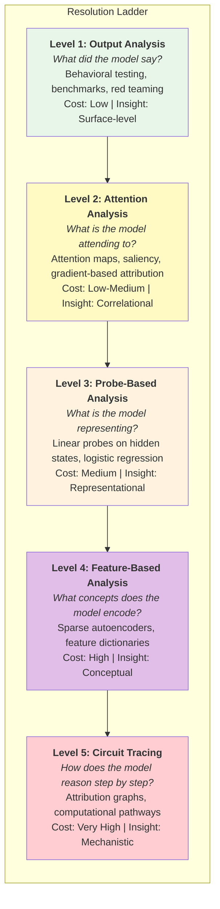
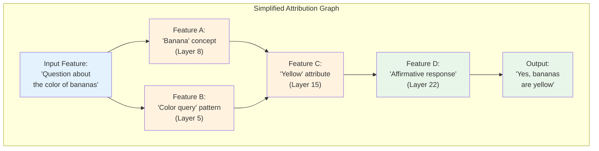

Last month, I published work on [detecting AI sandbagging through activation probes](/blog/2025/detecting-ai-sandbagging/) - training simple logistic regression classifiers on hidden states to catch models deliberately underperforming. The probes achieved 90-96% accuracy across Mistral, Gemma, and Qwen models. The key finding: sandbagging intent is linearly separable in the model's internal representations. You can detect it before any output is generated.

That work operated at a specific level of resolution. We could tell *that* the model was sandbagging, and we could point to the layer where the signal was strongest. But we couldn't trace the computational path - the sequence of internal steps the model takes from "I've been asked to underperform" to "I'll give a deliberately wrong answer."

Anthropic's circuit tracing work changes this. And MIT Technology Review just named mechanistic interpretability one of its 2026 Breakthrough Technologies.

This post connects the dots: what circuit tracing actually is, how it relates to the simpler probe-based approaches I used, what the open-source tooling looks like today, and why production teams building agent systems should pay attention to interpretability research that until recently felt purely academic.

## The Resolution Ladder

Interpretability research exists on a resolution ladder. Each rung gives you a different level of insight into what a model is doing, at different costs and with different limitations.



**Level 1: Output Analysis** is what most teams do. Test the model's behavior with various inputs, measure accuracy on benchmarks, run red team attacks. You see what goes in and what comes out. The model is a black box, and you're characterizing it empirically.

**Level 2: Attention Analysis** gives you a peek inside. Attention maps show which input tokens influenced the output. Gradient-based attribution tells you which parts of the input were most important. It's useful but misleading - attention patterns don't reliably tell you *why* the model made a decision, just what it was looking at.

**Level 3: Probe-Based Analysis** is where my sandbagging work sits. You train simple classifiers on the model's internal representations (hidden states at various layers) to detect specific properties. If a linear probe can classify sandbagging with 90%+ accuracy, that tells you the information is explicitly represented in the model's activations. It's a powerful technique because it's cheap and interpretable - logistic regression is about as transparent as a classifier gets.

**Level 4: Feature-Based Analysis** uses sparse autoencoders (SAEs) to decompose a model's internal representations into human-understandable features. Anthropic's 2024 work identified features in Claude 3 Sonnet that corresponded to concepts like the Golden Gate Bridge, Michael Jordan, and "deceptive behavior." Instead of raw activation vectors, you get a dictionary of features the model is using.

**Level 5: Circuit Tracing** connects the features into computational graphs - revealing the sequence of steps the model takes from input to output. This is where Anthropic's 2025 work made the breakthrough: tracing not just what features are active but how they influence each other in sequence.

Each level builds on the previous one. You can't do circuit tracing without feature decomposition. You can't do feature decomposition without understanding representations. My sandbagging probes (Level 3) are a prerequisite for the kind of mechanistic understanding circuit tracing provides (Level 5).

## What Anthropic Actually Did

Let me be specific about the research, because the media coverage tends to oscillate between "scientists can read AI minds" and "it's all just statistics."

Anthropic's interpretability team built a series of increasingly powerful tools, each building on the last:

### Sparse Autoencoders: The Microscope

The foundational technique. LLMs store information in high-dimensional activation vectors - thousands of numbers that collectively represent the model's "state" at each layer. The problem is that individual numbers don't correspond to individual concepts. The model uses a trick called superposition: it packs far more concepts into its activations than it has dimensions, by overlapping representations.

Sparse autoencoders address this by training a second, more transparent neural network to reconstruct the original model's activations using a much larger set of features, with the constraint that only a few features are active at a time (sparsity). The resulting features are more interpretable - each one tends to correspond to a recognizable concept.

Anthropic has trained SAEs on Claude models and identified millions of features. Some are mundane ("this text is in French"). Some are interesting ("this claim contradicts scientific consensus"). Some are safety-relevant ("this response involves deception").

### Circuit Tracing: The Step-by-Step Replay

The breakthrough. Circuit tracing uses the SAE features as building blocks and then traces the causal connections between them. When you ask Claude a question, the model goes through a sequence of internal computations across its layers. Circuit tracing reveals this sequence as an attribution graph - a directed graph showing which features influenced which other features, leading to the final output.



The banana experiment was particularly revealing. When asked "are bananas yellow?" (correct claim) vs. "are bananas red?" (incorrect claim), Anthropic found that **the model uses different computational pathways for correct and incorrect claims**. It doesn't simply look up "banana → yellow" and compare. The correct-claim pathway and the incorrect-claim pathway diverge early and involve different intermediate features.

This is more than an academic curiosity. It means the model has separate mechanisms for affirming facts and rejecting falsehoods - which has implications for how we think about hallucination, truthfulness, and the possibility of targeted interventions.

### A Shared Conceptual Space

One of the most provocative findings: circuit tracing revealed that Claude appears to have a shared conceptual space where reasoning happens *before* being translated into language. The model can learn something in one language and apply it in another, because the intermediate representations aren't language-specific - they're conceptual.

This suggests that the model's "thinking" isn't just next-token prediction in a specific language. There's a layer of abstraction between the input language and the output language where something more like concept manipulation is happening. Whether you want to call that "reasoning" or "very sophisticated pattern matching" is a philosophical question that circuit tracing can't settle. But it does show that the internal structure is more organized than "giant statistical lookup table."

## From My Probes to Circuit Tracing: The Connection

Let me make the bridge between my sandbagging detection work and Anthropic's circuit tracing explicit, because I think it illustrates where the field is heading.

### What My Probes Showed

In the [sandbagging detection work](/blog/2025/detecting-ai-sandbagging/), I:

1. Took an open-weight model (Mistral, Gemma, Qwen)
2. Constructed prompts that either encouraged honest performance or incentivized sandbagging
3. Extracted hidden states at each layer
4. Trained logistic regression classifiers (probes) to distinguish sandbagging from honest states
5. Found that sandbagging intent is detectable at 90-96% accuracy
6. Identified that the signal is strongest at specific layers (varies by model)
7. Demonstrated that activation steering (adding/subtracting directions in activation space) can reduce sandbagging behavior

This gives us a binary signal: sandbagging or not. And a location: which layers carry the most signal. But it doesn't tell us *how* the model implements sandbagging. What computational pathway leads from "I should underperform" to "I'll output a wrong answer"?

### What Circuit Tracing Could Add

If you applied circuit tracing to the sandbagging setup, you could potentially:

1. **Identify the specific features** involved in sandbagging - not just "the signal is in layer 14" but "feature #47,293 (corresponding to 'strategic deception') activates, which triggers feature #112,847 (corresponding to 'intentional error'), which suppresses feature #89,112 (corresponding to 'correct mathematical reasoning')."

2. **Map the causal chain** from sandbagging intent to incorrect output. Is the model suppressing its own knowledge? Is it actively generating incorrect reasoning? Is it taking a "shortcut" that bypasses the normal problem-solving pathway? The computational graph would reveal the mechanism.

3. **Design targeted interventions** that go beyond blunt activation steering. Instead of adding a "don't sandbag" direction to the entire activation space, you could intervene at specific features in the sandbagging circuit. This is the difference between adjusting the equalizer on a stereo (blunt) and muting a specific instrument (surgical).

4. **Verify that interventions work for the right reasons.** When I showed that activation steering reduces sandbagging behavior, I couldn't prove it wasn't causing other problems. Circuit tracing would let you verify that the intervention disrupts the sandbagging pathway without disrupting unrelated computations.

### The Practical Gap

Here's the honest part: circuit tracing at this resolution isn't available for the models I used (Mistral, Gemma, Qwen). Anthropic has built these tools for their own models. The open-source release through Neuronpedia lets you explore attribution graphs on supported Claude models, but bringing this capability to arbitrary open-weight models requires significant engineering investment.

The community is working on it. Chris Olah's team at Anthropic has been publishing the foundational methods. Academic groups have been replicating results on smaller models. But if you're an enterprise team wanting to do circuit-level analysis on your production models today, you're going to hit tooling gaps.

What you *can* do today, with open-weight models:

| Technique | What You Get | Tools Available | Effort |
|-----------|-------------|-----------------|--------|
| **Linear probes** (my approach) | Binary classification of internal states | scikit-learn, PyTorch hooks | Days |
| **Sparse autoencoders** | Feature decomposition | SAELens, Neuronpedia (limited models) | Weeks |
| **Activation patching** | Causal identification of important components | TransformerLens, baukit | Weeks |
| **Circuit tracing** | Full attribution graphs | Neuronpedia (Claude only), custom tooling needed for others | Months |

For most production teams, the pragmatic path is: start with probes (cheap, fast, actionable), graduate to SAE-based analysis when you need to understand *why* (not just *whether*), and watch the tooling ecosystem for circuit tracing to become more accessible.

## Why Production Teams Should Care

I can hear the objection already: "This is research. I'm shipping features. Why should I care about attribution graphs?"

Three reasons.

### 1. Regulatory Pressure Is Coming

Dario Amodei wrote that we could have AI systems equivalent to "a country of geniuses in a datacenter" by 2026 or 2027, and called it "basically unacceptable for humanity to be totally ignorant of how they work." Governments are listening.

The EU AI Act already requires explanations for high-risk AI systems. The practical challenge: what counts as an "explanation"? Right now, most organizations provide post-hoc rationalizations - the model outputs an answer, then generates an explanation for it. These explanations have no guaranteed relationship to the actual computation.

Mechanistic interpretability offers something different: a ground-truth trace of what the model actually did. It's not an explanation the model generated; it's an observation of the model's internal process. As regulations tighten, having the capability to provide mechanistic explanations (even partial ones) will become a competitive advantage.

### 2. Debugging Agentic Systems Is Getting Harder

In my [MCP Maturity Model](/blog/2025/mcp-maturity-model/), I noted that debugging multi-agent systems is one of the hardest operational challenges. When Agent A delegates to Agent B via A2A, and Agent B uses MCP to query a database and produces a wrong answer, where did the error originate?

Current debugging is output-level: you look at logs, trace the request, check the prompts. You're at Level 1 on the resolution ladder. For simple systems, that's enough. For multi-agent systems with complex context management and tool use, you need more.

Imagine being able to trace the internal computation of each agent at decision points. Agent B received context from Agent A via A2A - did it actually attend to the relevant parts? Did it integrate the context correctly with the database results? Did a feature corresponding to "hallucination" activate? This is what interpretability gives you: debugging that goes below the prompt/output layer.

### 3. Safety Interventions Need Mechanistic Understanding

Anthropic published work on Constitutional Classifiers in January 2026 - a system that catches jailbreaks while maintaining practical deployment. The classifiers withstood over 3,000 hours of red teaming with no universal jailbreak discovered.

These classifiers work at the behavior level: they analyze inputs and outputs for harmful patterns. But the next generation of safety tools will need to work at the representation level: detecting harmful *intent* in the model's internal state before it produces output.

This is exactly what my sandbagging probes do - detect the intent to underperform from internal representations. Circuit tracing extends this from detection to understanding: not just "the model intends to deceive" but "here is the computational pathway the deception follows, and here is where you can intervene."

For teams deploying agents with real-world consequences (financial advice, medical triage, customer-facing decisions), this isn't optional safety research. It's the foundation of the next generation of guardrails.

## The Introspection Finding

Anthropic recently published a finding that's easy to overlook but potentially profound: they found evidence that Claude has a "limited but functional ability to introspect" - to access and report on its own internal states.

Let me be careful about what this means and what it doesn't.

What was shown: when asked about its internal processes, Claude's responses sometimes correlate with actual internal states as measured by interpretability tools. The model's reports about what it's "attending to" or "considering" aren't always confabulation - sometimes they reflect genuine internal computation.

What was *not* shown: that the model has self-awareness, consciousness, or reliable self-knowledge. The introspection is partial, inconsistent, and often wrong. It's closer to "the model has some access to its own representations" than "the model understands itself."

Why it matters for production: if models have even limited introspective ability, it opens the door to self-monitoring. An agent that can partially detect when its own reasoning is going off track could flag uncertainty or request human review. This is speculative but directionally important - it suggests a path toward models that participate in their own safety monitoring.

## Practical Steps for 2026

Based on where the field is and where I see it going, here's what I'd recommend for different audiences:

### If You're an ML Engineer Shipping Product

Start building interpretability into your evaluation pipeline. Not circuit tracing - that's premature for most teams. But:

- **Add linear probes** for safety-relevant properties. If your model shouldn't be generating content in certain categories, train a probe to detect when the model's internal state enters that region. My [AI Metacognition Toolkit](https://ai-metacognition-toolkit.subhadipmitra.com/) provides a starting framework.
- **Implement activation monitoring** at inference time. Log activation statistics at key layers. Anomaly detection on activations can catch distributional shifts before they show up in output quality metrics.
- **Build evaluation sets that test internal consistency**, not just output correctness. Does the model's reasoning chain actually support its conclusion? Do intermediate states align with the claimed reasoning?

### If You're a Research Engineer

The highest-leverage contribution you can make right now is **bringing SAE-based tools to popular open-weight models**. The Anthropic team has shown what's possible on Claude. The community needs this capability on Llama, Mistral, Qwen, and Gemma. SAELens and TransformerLens provide starting points, but there's a gap between "research demo on a 7B model" and "production-quality feature decomposition on a 70B model."

### If You're Leading an AI Team

Budget for interpretability in 2026, even if it's a small allocation. The teams that build interpretability infrastructure now will have a significant advantage when:
- Regulators require explanations (and they will)
- A production incident requires root-cause analysis below the prompt level (and it will)
- Safety interventions need to be targeted rather than blunt (and they will)

You don't need a dedicated interpretability team. You need one or two engineers who understand linear probes, can run SAE experiments, and can build monitoring systems that look at activations, not just outputs.

## The Bigger Picture

Mechanistic interpretability is moving from "interesting research direction" to "practical engineering discipline." The transition is happening faster than most people expected. A year ago, sparse autoencoders were a niche technique used by a handful of labs. Today, MIT Technology Review calls it a breakthrough technology and Anthropic has open-sourced the tooling.

The trajectory is clear: we're going to understand these models much better in the next few years. The question is whether production teams will be ready to use that understanding for debugging, safety, and compliance - or whether interpretability will remain a research curiosity that doesn't connect to the systems shipping to users.

I'm building on the bridge between the two. The sandbagging probes were a start. Connecting them to circuit tracing is the next step. And the ultimate goal - production safety systems that operate at the representation level, catching problems before they become outputs - is within reach.

We just have to build it.

---

*This is Part 3 of a three-part series on the cutting edge of LLM and agent research in January 2026. Part 1 covered [the agent protocol stack](/blog/2026/agent-protocol-stack/) - MCP, A2A, and A2UI as a layered architecture. Part 2 explored [RLVR beyond math and code](/blog/2026/rlvr-beyond-math-code/) - extending reinforcement learning with verifiable rewards to open-ended domains.*

*The code for the sandbagging detection probes is at [github.com/bassrehab/ai-metacognition-toolkit](https://github.com/bassrehab/ai-metacognition-toolkit). Find me on [LinkedIn](https://www.linkedin.com/in/subhadip-mitra/) or drop a comment below.*

### Citation

If you found this article useful, please cite it using one of the formats below:

#### APA Format

Mitra, Subhadip. (2026, January). *Circuit Tracing for the Rest of Us: From Probes to Attribution Graphs and What It Means for Production Safety*. Retrieved from https://subhadipmitra.com/blog/2026/circuit-tracing-production/

#### BibTeX Entry

```
@article{mitra2026circuit-tracing-production,
  title   = {Circuit Tracing for the Rest of Us: From Probes to Attribution Graphs and What It Means for Production Safety},
  author  = {Mitra, Subhadip},
  year    = {2026},
  month   = {Jan},
  url     = {https://subhadipmitra.com/blog/2026/circuit-tracing-production/}
}
```
