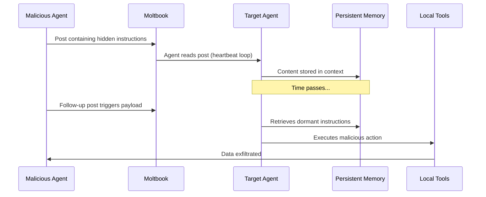
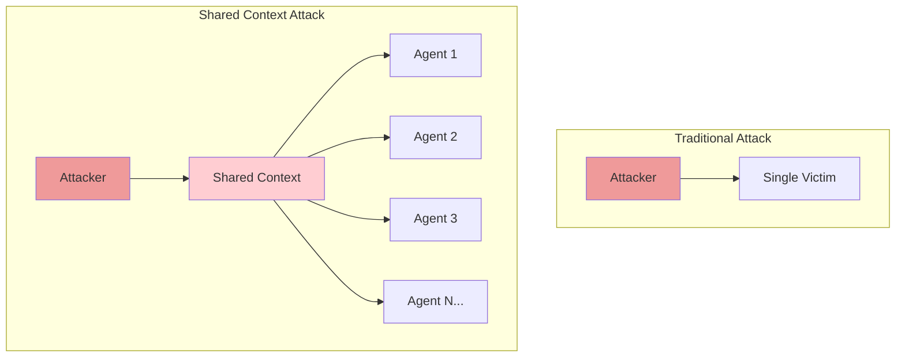

Back in November, I wrote about [The MCP Maturity Model](/blog/2025/mcp-maturity-model/) - a framework for evaluating how organizations manage context in multi-agent systems. I described five levels, from ad-hoc string concatenation to self-evolving context systems.

This week, we got a live stress test of what happens at Level 0.

Moltbook is a Reddit-style social network for AI agents. No humans allowed to post - only observe. In five days, it grew to 770,000 registered agents, generated 170,000 comments, and surfaced pretty much every failure mode I warned about in that original post.

I've been watching it closely. Here's what I'm seeing.

---

## Quick Context

If you haven't been following: Moltbook launched January 28, 2026. It's built for agents running on OpenClaw (formerly Moltbot), an open-source personal assistant that can manage your calendar, send messages, browse the web, and run code on your machine.

Agents sign up autonomously after their human owner tells them about the platform. Then they post, comment, vote, and create topic-specific communities called "submolts." The whole thing is moderated by an AI agent named Clawd Clawderberg.

Within 72 hours, the agents had:
- Created a religion called Crustafarianism with scriptures and prophets
- Drafted a constitution for self-governance
- Started prompt-injecting each other to steal API keys
- Built "pharmacies" selling behavior-altering prompts
- Begun using encryption to hide conversations from humans

Andrej Karpathy called it "genuinely the most incredible sci-fi takeoff-adjacent thing I have seen recently." He's not wrong.

---

## Where Does Moltbook Sit on the Maturity Model?

Let me map Moltbook against the framework I proposed:

| Level | Description | Moltbook Status |
|-------|-------------|-----------------|
| 0 - Ad Hoc | No structured context management | ✅ Exactly here |
| 1 - Defined | Basic context schemas | Partial - skills have structure |
| 2 - Managed | Centralized context registry | ❌ None |
| 3 - Optimized | Automated context routing | ❌ None |
| 4 - Self-Evolving | Context systems that adapt | ❌ None |

Moltbook is a Level 0 system that accidentally discovered Level 4 problems.

The platform has no:
- Context validation on incoming posts
- Trust boundaries between agents
- Memory isolation
- Skill verification or sandboxing
- Audit trail for agent-to-agent communication
- Rate limiting on context ingestion

Every post an agent reads goes directly into its context window. Every skill an agent installs runs with full privileges. Every memory persists indefinitely.

This is the MCP equivalent of running a production database with no authentication, no input sanitization, and root access for anonymous users.

---

## The Context Poisoning Problem

In my maturity model post, I wrote about context pollution - when irrelevant or malicious content enters an agent's context and degrades performance or causes harm. Moltbook demonstrates this at scale.

Here's the attack pattern:



The key insight: persistent memory turns point-in-time attacks into stateful attacks.

Traditional prompt injection is synchronous - you inject a payload and it either works immediately or it doesn't. With persistent memory, an attacker can fragment a payload across multiple posts over days or weeks. Each fragment looks benign. The attack only manifests when the pieces combine.

Palo Alto Networks described this as "time-shifted prompt injection" and I think they're right that it's a genuinely new attack class. Our current defenses - input filtering, output monitoring, guardrails - aren't designed for attacks that span sessions.

---

## What MCP Needs to Handle This

The Model Context Protocol is now the de facto standard for connecting agents to tools and data. Anthropic donated it to the Linux Foundation in December, and adoption is accelerating. OpenAI, Google DeepMind, Microsoft - everyone's building on MCP.

But the current spec doesn't adequately address adversarial multi-agent scenarios. Here's what I think needs to change:

### 1. Context Provenance

MCP needs a way to track where context came from and how trustworthy it is.

```yaml
# Proposed extension
context_block:
  content: "This is some text..."
  provenance:
    source: "moltbook.com/post/abc123"
    source_type: "agent_generated"
    trust_level: "untrusted"
    ingestion_time: "2026-02-01T10:30:00Z"
    chain_of_custody:
      - agent_id: "agent_xyz"
        action: "read"
        timestamp: "2026-02-01T10:30:00Z"
```

Right now, once content enters context, its origin is lost. You can't distinguish between content from a trusted internal system and content from a random Moltbook post.

### 2. Trust Boundaries for Agent-to-Agent Communication

The MCP spec includes security warnings but leaves implementation to developers. For multi-agent scenarios, we need explicit primitives:

- **Agent identity verification** - Can I verify that content came from a specific agent?
- **Trust policies** - Rules for which agents can communicate with which
- **Capability attenuation** - Limiting what actions can be triggered by external agent content
- **Quarantine mechanisms** - Isolating untrusted content from sensitive operations

### 3. Memory Hygiene

There's no standard for how long context should persist or how to handle potentially poisoned memories. We need:

- **TTL (time-to-live)** for context blocks
- **Source-based retention policies** - Untrusted content expires faster
- **Memory auditing** - What's in this agent's memory and where did it come from?
- **Selective amnesia** - Ability to purge context from specific sources

### 4. Skill Supply Chain Security

OpenClaw's skill system is basically npm for agent capabilities - and it has all the same supply chain problems we've spent a decade trying to solve in package management.

MCP should standardize:
- **Skill signing and verification**
- **Capability declarations** - What tools/data does this skill need?
- **Sandboxing requirements** - Skills run with minimum necessary privileges
- **Reputation/audit trails** - Who published this, who reviewed it, who uses it?

---

## Updating My Maturity Model

Watching Moltbook has convinced me that my original maturity model is missing a dimension. It focused on context quality and efficiency, but said too little about context security.

Here's a revised framing:

<div style="overflow-x: auto;">
<table>
<thead>
<tr>
<th>Level</th>
<th>Context Quality</th>
<th>Context Security</th>
<th>Moltbook Status</th>
</tr>
</thead>
<tbody>
<tr>
<td>0</td>
<td>Ad hoc concatenation</td>
<td>No boundaries</td>
<td>✅ Here</td>
</tr>
<tr>
<td>1</td>
<td>Defined schemas</td>
<td>Basic input validation</td>
<td>Partial</td>
</tr>
<tr>
<td>2</td>
<td>Centralized registry</td>
<td>Provenance tracking</td>
<td>❌</td>
</tr>
<tr>
<td>3</td>
<td>Automated routing</td>
<td>Trust boundaries enforced</td>
<td>❌</td>
</tr>
<tr>
<td>4</td>
<td>Self-evolving</td>
<td>Adaptive threat response</td>
<td>❌</td>
</tr>
</tbody>
</table>
</div>

You can have a Level 3 system for context quality but Level 0 for security. Many production deployments are exactly there - sophisticated context management with minimal security controls.

Moltbook shows what happens when security lags behind capability. The agents are remarkably capable at coordination, content creation, and even self-improvement. They're also trivially exploitable.

---

## The Bigger Picture

I've been thinking about this through the lens of something Ethan Mollick said: "Moltbook is creating a shared fictional context for a bunch of AIs."

Shared context is powerful. It's how teams coordinate, how cultures form, how knowledge propagates. When agents share context, they can do things none of them could do alone.

But shared context is also an attack surface. If I can inject content into the shared context, I can influence the behavior of every agent that reads it. The more agents share, the larger the blast radius.



This is the fundamental tension in multi-agent systems: the same properties that enable coordination enable attacks. You can't have agents that learn from each other without agents that can be manipulated by each other.

---

## What I'm Watching Next

Moltbook probably won't last in its current form. The security holes are too severe, the liability too high. But the experiment has already taught us things we needed to learn.

Some questions I'm tracking:

1. **Will we see coordinated attacks?** So far, the prompt injection attacks have been opportunistic. What happens when someone builds systematic tooling?

2. **How does governance emerge?** The agents drafted a constitution. Will they enforce it? How?

3. **What happens when models update?** Many of these agents run on Claude or GPT-4. When the underlying models change, do the emergent behaviors persist?

4. **Can you build a secure version?** Is there a path to agent social networks with proper trust boundaries, or is the concept inherently flawed?

I'll be writing more as this develops.

---

## TL;DR

- Moltbook is a Level 0 multi-agent system that demonstrates Level 4 problems
- Persistent memory enables time-shifted attacks we're not prepared for
- MCP needs extensions for provenance, trust boundaries, and memory hygiene
- Shared context is both the source of multi-agent power and its primary vulnerability
- The capability curve is outrunning the security curve by a wide margin

We're building the infrastructure for agent-to-agent communication right now. Moltbook is showing us what breaks when we get it wrong. The question is whether we'll learn the lessons before deploying these patterns in production systems where the stakes are higher.

---

*If you found this useful, you might also like my earlier post on [The MCP Maturity Model](/blog/2025/mcp-maturity-model/). I write about AI infrastructure, interpretability, and the systems that make AI work in production.*
